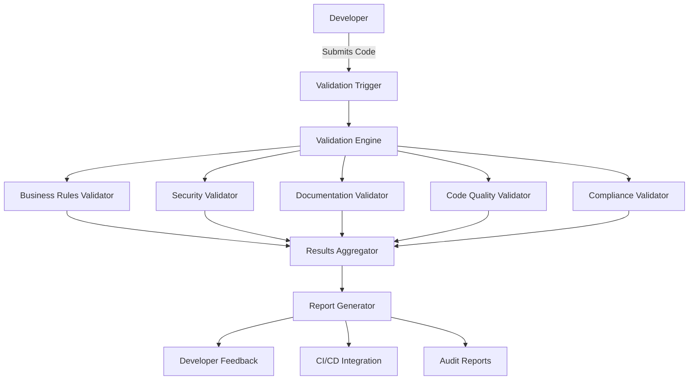

# Design Document: Code Validation System

## Overview

The Code Validation System is designed to provide comprehensive validation of code against business rules, security standards, documentation requirements, code quality metrics, and compliance frameworks before publishing or deployment. The system will integrate with existing development workflows and CI/CD pipelines to provide automated validation at key points in the development process.

The design follows a modular architecture that allows for extensibility and customization, enabling teams to adapt the validation process to their specific needs while maintaining a consistent validation framework.

## Architecture

The Code Validation System follows a plugin-based architecture with a core validation engine and specialized validators that can be enabled, disabled, or customized based on project requirements.

### High-Level Architecture



### Core Components

1. **Validation Trigger**: Initiates the validation process based on events (commit, PR, manual trigger, etc.)
2. **Validation Engine**: Orchestrates the validation process, loading appropriate validators and configurations
3. **Specialized Validators**: Individual validation modules for specific aspects (business rules, security, etc.)
4. **Results Aggregator**: Collects and normalizes results from all validators
5. **Report Generator**: Creates comprehensive reports in various formats for different stakeholders

## Components and Interfaces

### Validation Engine

The Validation Engine is the central component that coordinates the validation process.

```typescript
interface ValidationEngine {
  initialize(config: ValidationConfig): Promise<void>;
  registerValidator(validator: Validator): void;
  validate(codebase: Codebase): Promise<ValidationResult>;
  getAvailableValidators(): Validator[];
}
```

### Validator Interface

All specialized validators implement a common interface:

```typescript
interface Validator {
  id: string;
  name: string;
  description: string;
  version: string;
  
  initialize(config: ValidatorConfig): Promise<void>;
  validate(codebase: Codebase): Promise<ValidatorResult>;
  getSupportedLanguages(): string[];
  getConfigSchema(): JsonSchema;
}
```

### Business Rules Validator

Validates code against defined business rules and logic.

```typescript
interface BusinessRulesValidator extends Validator {
  loadBusinessRules(rulesPath: string): Promise<void>;
  mapCodeToBusinessRules(code: CodeUnit): BusinessRuleMapping[];
}
```

### Security Validator

Scans code for security vulnerabilities and best practices.

```typescript
interface SecurityValidator extends Validator {
  loadSecurityPatterns(patternsPath: string): Promise<void>;
  calculateRiskScore(findings: SecurityFinding[]): number;
  getSupportedFrameworks(): SecurityFramework[];
}
```

### Documentation Validator

Checks code for proper documentation coverage and quality.

```typescript
interface DocumentationValidator extends Validator {
  loadDocumentationStandards(standardsPath: string): Promise<void>;
  calculateDocumentationCoverage(codebase: Codebase): number;
}
```

### Code Quality Validator

Analyzes code for quality issues, complexity, and maintainability.

```typescript
interface CodeQualityValidator extends Validator {
  loadQualityRules(rulesPath: string): Promise<void>;
  calculateComplexityMetrics(code: CodeUnit): ComplexityMetrics;
  detectCodeSmells(code: CodeUnit): CodeSmell[];
  findDuplication(codebase: Codebase): DuplicationResult[];
}
```

### Compliance Validator

Validates code against regulatory and compliance requirements.

```typescript
interface ComplianceValidator extends Validator {
  loadComplianceFrameworks(frameworksPath: string): Promise<void>;
  getSupportedFrameworks(): ComplianceFramework[];
  generateAuditReport(findings: ComplianceFinding[]): AuditReport;
}
```

### Results Aggregator

Collects and normalizes results from all validators.

```typescript
interface ResultsAggregator {
  addResult(validatorId: string, result: ValidatorResult): void;
  getAggregatedResults(): ValidationResult;
  getResultsByValidator(validatorId: string): ValidatorResult | null;
  getSummary(): ValidationSummary;
}
```

### Report Generator

Creates reports in various formats for different stakeholders.

```typescript
interface ReportGenerator {
  generateReport(results: ValidationResult, format: ReportFormat): Report;
  getSupportedFormats(): ReportFormat[];
}
```

## Data Models

### Codebase

Represents the code being validated.

```typescript
interface Codebase {
  id: string;
  rootPath: string;
  files: CodeFile[];
  metadata: Record<string, any>;
}

interface CodeFile {
  path: string;
  language: string;
  content: string;
  units: CodeUnit[];
}

interface CodeUnit {
  type: 'class' | 'function' | 'method' | 'module' | 'other';
  name: string;
  startLine: number;
  endLine: number;
  complexity: number;
  documentation: DocumentationInfo;
}
```

### Validation Results

Represents the results of the validation process.

```typescript
interface ValidationResult {
  id: string;
  timestamp: string;
  codebaseId: string;
  validatorResults: Record<string, ValidatorResult>;
  summary: ValidationSummary;
}

interface ValidatorResult {
  validatorId: string;
  status: 'success' | 'failure' | 'warning' | 'error';
  findings: Finding[];
  metrics: Record<string, number>;
}

interface Finding {
  id: string;
  type: FindingType;
  severity: 'critical' | 'high' | 'medium' | 'low' | 'info';
  message: string;
  location: CodeLocation;
  remediation?: string;
}

interface CodeLocation {
  filePath: string;
  startLine: number;
  endLine: number;
  startColumn?: number;
  endColumn?: number;
}

interface ValidationSummary {
  totalFiles: number;
  totalFindings: number;
  findingsBySeverity: Record<string, number>;
  findingsByValidator: Record<string, number>;
  overallStatus: 'pass' | 'fail' | 'warning';
}
```

### Configuration

Represents the configuration for the validation system and individual validators.

```typescript
interface ValidationConfig {
  enabled: boolean;
  validators: Record<string, ValidatorConfig>;
  reporting: ReportingConfig;
  integration: IntegrationConfig;
}

interface ValidatorConfig {
  enabled: boolean;
  severity: 'error' | 'warning' | 'info';
  options: Record<string, any>;
  rules: Rule[];
}

interface Rule {
  id: string;
  enabled: boolean;
  severity: 'critical' | 'high' | 'medium' | 'low' | 'info';
  parameters: Record<string, any>;
}

interface ReportingConfig {
  formats: ReportFormat[];
  outputs: ReportOutput[];
  thresholds: Record<string, number>;
}

interface IntegrationConfig {
  cicd: CICDConfig;
  vcs: VCSConfig;
  notifications: NotificationConfig;
}
```

## Error Handling

The validation system implements a comprehensive error handling strategy to ensure robustness and provide meaningful feedback when issues occur.

### Error Types

1. **ConfigurationError**: Errors related to system or validator configuration
2. **ValidationError**: Errors that occur during the validation process
3. **IntegrationError**: Errors related to external system integration
4. **PluginError**: Errors from third-party validator plugins

### Error Handling Strategy

1. **Graceful Degradation**: If a validator fails, the system continues with other validators
2. **Detailed Logging**: All errors are logged with context for troubleshooting
3. **User Feedback**: Clear error messages are provided to users with potential solutions
4. **Retry Mechanism**: Critical operations have built-in retry logic with exponential backoff

### Error Reporting

Errors are reported through multiple channels:

1. **Console Output**: Immediate feedback for CLI usage
2. **Log Files**: Detailed logs for troubleshooting
3. **Notification System**: Alerts for critical errors
4. **API Responses**: Structured error responses for programmatic usage

## Testing Strategy

The validation system requires comprehensive testing to ensure reliability and accuracy.

### Unit Testing

- Test individual validators in isolation
- Mock dependencies and external systems
- Verify correct behavior for various input scenarios
- Test error handling and edge cases

### Integration Testing

- Test interaction between validators and the validation engine
- Verify correct aggregation of results
- Test configuration loading and application
- Verify report generation with different formats

### System Testing

- End-to-end tests with real codebases
- Verify integration with CI/CD systems
- Test performance with large codebases
- Verify customization and extension mechanisms

### Validation Testing

- Verify that validators correctly identify issues in sample code
- Test against known-good and known-bad code samples
- Verify that remediation suggestions are accurate and helpful
- Test against real-world vulnerability databases

## Security Considerations

The validation system itself must be secure to maintain trust and integrity.

### Secure Configuration

- Configuration files should be validated before use
- Sensitive configuration (API keys, etc.) should be encrypted or stored securely
- Configuration changes should be logged and auditable

### Plugin Security

- Third-party validators should run in isolated environments
- Resource limits should be enforced to prevent DoS
- Validators should have limited access to the filesystem and network

### Data Security

- Code being validated may contain sensitive information
- Results may reveal security vulnerabilities
- Access to reports should be controlled based on user roles

## Integration Points

The validation system integrates with various external systems to provide a seamless developer experience.

### Version Control Systems

- Git hooks for pre-commit and pre-push validation
- Integration with GitHub, GitLab, Bitbucket APIs for PR/MR validation
- Status reporting back to VCS platforms

### CI/CD Pipelines

- Jenkins, GitHub Actions, GitLab CI, Azure DevOps integration
- Pipeline stage for validation
- Blocking or non-blocking validation based on configuration

### Issue Tracking

- Automatic creation of issues for findings
- Linking findings to existing issues
- Issue status synchronization

### Notification Systems

- Email notifications for validation results
- Slack, MS Teams integration for real-time alerts
- Custom webhook support for integration with other systems

## Deployment and Scaling

The validation system can be deployed in various configurations to meet different needs.

### Local Deployment

- Developers run validation locally before committing
- CLI tool for manual validation
- IDE plugins for real-time validation

### Server Deployment

- Central validation server for teams
- API for programmatic access
- Web interface for configuration and reporting

### Cloud Deployment

- SaaS offering for validation as a service
- Scalable architecture for handling large codebases
- Multi-tenant support with isolation

### Scaling Strategy

- Horizontal scaling for handling multiple validation requests
- Caching of validation results for improved performance
- Distributed processing for large codebases