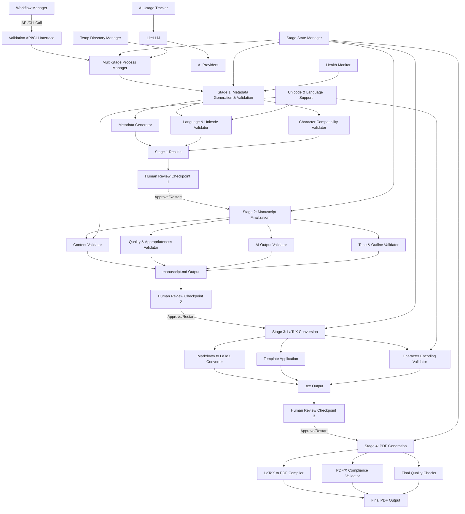

# Design Document: LibriScribe Code Validation System

## Overview

The LibriScribe Code Validation System is designed to provide comprehensive validation of both generated book content and the underlying LibriScribe system code before publishing. The system ensures that AI-generated books meet quality standards, the LibriScribe platform maintains code quality, and the publishing process adheres to industry best practices.

The design follows a single-process architecture optimized for handling ~100 parallel requests with 20-minute processing times. The system is AI-bounded and integrates with the existing LiteLLM proxy for all AI queries. It focuses on comprehensive quality validation with human review thresholds for content that doesn't meet quality standards.

## Architecture

The LibriScribe Code Validation System is designed as a standalone API/CLI tool that integrates with LibriScribe's book generation workflow. The system focuses on comprehensive quality validation with human review thresholds, tone consistency validation, and outline adherence checking. All AI queries are routed through the existing LiteLLM proxy with intelligent content chunking for manuscripts exceeding 50K tokens.

### High-Level Architecture



### Core Components

1. **Validation API/CLI Interface**: Provides RESTful API endpoints and command-line interface for external workflow integration
2. **Multi-Stage Process Manager**: Orchestrates the four-stage workflow with restart capability at each stage
3. **Stage State Manager**: Manages stage completion status, intermediate outputs, and restart points
4. **Human Review Interface**: Provides interface for human reviewers with checkpoints between stages
5. **Quality Assessment Engine**: Implements comprehensive scoring system with configurable human review thresholds
6. **Content Chunking Manager**: Handles intelligent content chunking for manuscripts exceeding 50K tokens with specialized model selection
7. **Language & Unicode Validator**: Ensures consistent language usage and validates Unicode character compatibility
8. **Character Compatibility Validator**: Identifies problematic characters for printing and suggests alternatives
9. **Tone Consistency Validator**: Validates that original tone matches the final document tone
10. **Outline Adherence Validator**: Ensures the final content matches the original outline and resume
11. **Markdown to LaTeX Converter**: Converts finalized manuscript.md to LaTeX format with proper character encoding
12. **PDF Generation Engine**: Handles LaTeX to PDF compilation with PDF/X compliance validation
13. **Results Aggregator**: Collects and normalizes results from all validators with comprehensive scoring
14. **Report Generator**: Creates comprehensive reports with quality scores and human review recommendations
15. **LiteLLM Integration**: Routes all AI queries through existing LiteLLM proxy with usage tracking
16. **Hallucination Detection System**: Implements fact verification, consistency checking, and confidence scoring

## Components and Interfaces

### Data Model Extensions

The validation system extends the existing `ProjectKnowledgeBase` class from `src/libriscribe/knowledge_base.py` rather than creating new data models. This ensures compatibility with the existing LibriScribe system.

```python
# Extensions to existing ProjectKnowledgeBase class
from libriscribe.knowledge_base import ProjectKnowledgeBase, Character, Chapter, Scene
from typing import Dict, List, Optional
from dataclasses import dataclass
from enum import Enum
from datetime import datetime

class ValidationStatus(Enum):
    NOT_STARTED = "not_started"
    IN_PROGRESS = "in_progress"
    COMPLETED = "completed"
    FAILED = "failed"
    NEEDS_HUMAN_REVIEW = "needs_human_review"

@dataclass
class ValidationMetadata:
    validation_id: str
    timestamp: datetime
    status: ValidationStatus
    quality_score: float
    human_review_required: bool
    original_tone: str
    original_outline: str
    validation_results: Dict[str, Any]

# Extend ProjectKnowledgeBase with validation support
class ValidatedProjectKnowledgeBase(ProjectKnowledgeBase):
    validation_history: List[ValidationMetadata] = Field(default_factory=list)
    current_validation: Optional[ValidationMetadata] = None
    quality_thresholds: Dict[str, float] = Field(default_factory=dict)
```

### Validation API/CLI Interface

The main interface for external systems to interact with the validation system.

```python
from abc import ABC, abstractmethod
from typing import Dict, List, Optional
from dataclasses import dataclass
from enum import Enum
import uuid
import tempfile
import os

class ValidationInterface:
    def __init__(self, config: ValidationConfig):
        self.config = config
        self.resource_manager = ResourceManager()
        self.validation_engine = ValidationEngine()
        self.health_monitor = HealthMonitor()
        self.ai_usage_tracker = AIUsageTracker()
        
    async def validate_project(self, knowledge_base_path: str, project_id: str = None) -> ValidationResult:
        """Main API entry point for project validation using existing ProjectKnowledgeBase"""
        if not project_id:
            project_id = str(uuid.uuid4())
            
        # Create isolated workspace
        workspace = await self.resource_manager.create_workspace(project_id)
        
        try:
            # Load existing ProjectKnowledgeBase
            knowledge_base = ProjectKnowledgeBase.load_from_file(knowledge_base_path)
            if not knowledge_base:
                raise ValidationError(f"Could not load knowledge base from {knowledge_base_path}")
            
            # Convert to ValidatedProjectKnowledgeBase
            validated_kb = ValidatedProjectKnowledgeBase(**knowledge_base.model_dump())
            
            # Run validation with AI usage tracking
            result = await self.validation_engine.validate(validated_kb, project_id)
            
            # Update knowledge base with validation results
            validated_kb.current_validation = result.metadata
            validated_kb.validation_history.append(result.metadata)
            
            # Save updated knowledge base
            validated_kb.save_to_file(knowledge_base_path)
            
            # Generate reports and metadata
            await self._generate_outputs(result, workspace)
            
            return result
        except Exception as e:
            # Fail fast with proper error code
            await self.resource_manager.cleanup_workspace(workspace)
            raise ValidationError(f"Validation failed: {str(e)}") from e
        finally:
            # Always cleanup resources
            await self.resource_manager.cleanup_workspace(workspace)
            
    async def validate_chapter(self, chapter_path: str, project_context: str, project_id: str) -> ValidationResult:
        """Validate individual chapter content"""
        pass
        
    def get_system_health(self) -> HealthStatus:
        """Get current system health status"""
        return self.health_monitor.get_status()
```

### Resource Manager

Manages unique temporary directories and resource isolation for parallel processing.

```python
import tempfile
import shutil
import os
from pathlib import Path
from typing import Dict, Optional
import asyncio

class ResourceManager:
    def __init__(self):
        self.active_workspaces: Dict[str, Path] = {}
        self.base_temp_dir = Path(tempfile.gettempdir()) / "libriscribe_validation"
        self.base_temp_dir.mkdir(exist_ok=True)
        
    async def create_workspace(self, project_id: str) -> Path:
        """Create unique workspace for validation process"""
        workspace_id = f"{project_id}_{uuid.uuid4().hex[:8]}"
        workspace_path = self.base_temp_dir / workspace_id
        workspace_path.mkdir(parents=True, exist_ok=True)
        
        # Create subdirectories
        (workspace_path / "input").mkdir()
        (workspace_path / "output").mkdir()
        (workspace_path / "temp").mkdir()
        (workspace_path / "reports").mkdir()
        
        self.active_workspaces[project_id] = workspace_path
        return workspace_path
        
    async def cleanup_workspace(self, workspace_path: Path) -> None:
        """Clean up workspace and temporary files"""
        try:
            if workspace_path.exists():
                shutil.rmtree(workspace_path)
        except Exception as e:
            # Log error but don't fail the process
            logger.error(f"Failed to cleanup workspace {workspace_path}: {e}")
            
    def get_unique_temp_file(self, workspace: Path, suffix: str = "") -> Path:
        """Get unique temporary file path within workspace"""
        return workspace / "temp" / f"{uuid.uuid4().hex}{suffix}"
```

### Validator Interface

All LibriScribe validators implement a common interface:

```python
class ValidatorBase(ABC):
    def __init__(self, validator_id: str, name: str, version: str):
        self.validator_id = validator_id
        self.name = name
        self.version = version
        
    @abstractmethod
    async def initialize(self, config: ValidatorConfig) -> None:
        """Initialize validator with configuration"""
        pass
        
    @abstractmethod
    async def validate(self, content: ValidationContent) -> ValidatorResult:
        """Perform validation on content"""
        pass
        
    @abstractmethod
    def get_supported_content_types(self) -> List[str]:
        """Return supported content types (chapter, manuscript, code, etc.)"""
        pass
```

### Content Validator

Validates generated book content using existing ProjectKnowledgeBase data structures.

```python
from libriscribe.knowledge_base import ProjectKnowledgeBase, Character, Chapter

class ContentValidator(ValidatorBase):
    def __init__(self):
        super().__init__("content_validator", "Content Validator", "1.0.0")
        
    async def validate_tone_consistency(self, knowledge_base: ProjectKnowledgeBase) -> ToneValidationResult:
        """Validate that the final content maintains the original intended tone from knowledge_base.tone"""
        original_tone = knowledge_base.tone
        # Analyze chapters and scenes for tone consistency
        pass
        
    async def validate_outline_adherence(self, knowledge_base: ProjectKnowledgeBase) -> OutlineValidationResult:
        """Ensure the final content matches the original outline stored in knowledge_base.outline"""
        original_outline = knowledge_base.outline
        chapters = knowledge_base.chapters
        # Compare actual chapter structure with original outline
        pass
        
    async def assess_content_quality(self, knowledge_base: ProjectKnowledgeBase) -> QualityScore:
        """Comprehensive quality assessment using existing chapter and scene data"""
        pass
        
    async def detect_hallucinations(self, knowledge_base: ProjectKnowledgeBase) -> HallucinationReport:
        """Detect potential hallucinations using worldbuilding and character consistency"""
        pass
        
    async def validate_narrative_consistency(self, knowledge_base: ProjectKnowledgeBase) -> List[Finding]:
        """Check for narrative consistency across chapters using existing Chapter objects"""
        chapters = list(knowledge_base.chapters.values())
        pass
        
    async def validate_character_consistency(self, knowledge_base: ProjectKnowledgeBase) -> List[Finding]:
        """Validate character consistency using existing Character objects and their appearances in scenes"""
        characters = knowledge_base.characters
        chapters = knowledge_base.chapters
        pass
```

### Publishing Standards Validator

Validates manuscript against industry publishing standards.

```python
class PublishingStandardsValidator(ValidatorBase):
    def __init__(self):
        super().__init__("publishing_validator", "Publishing Standards Validator", "1.0.0")
        
    async def validate_manuscript_formatting(self, manuscript: Manuscript) -> List[Finding]:
        """Check manuscript formatting against industry standards"""
        pass
        
    async def validate_metadata(self, project: LibriScribeProject) -> List[Finding]:
        """Verify required book metadata is present and correct"""
        pass
        
    async def validate_length_requirements(self, manuscript: Manuscript, genre: str) -> List[Finding]:
        """Confirm book meets target length for its category"""
        pass
        
    async def validate_structure(self, chapters: List[Chapter]) -> List[Finding]:
        """Verify proper chapter organization and flow"""
        pass
```

### Quality and Originality Validator

Checks content quality, grammar, and originality.

```python
class QualityOriginalityValidator(ValidatorBase):
    def __init__(self):
        super().__init__("quality_validator", "Quality & Originality Validator", "1.0.0")
        
    async def check_plagiarism(self, content: str) -> PlagiarismResult:
        """Check content against known sources for plagiarism"""
        pass
        
    async def assess_quality_metrics(self, content: str) -> QualityMetrics:
        """Assess grammar, spelling, and readability"""
        pass
        
    async def verify_factual_accuracy(self, content: str, genre: str) -> List[Finding]:
        """Verify factual accuracy for non-fiction content"""
        pass
        
    async def validate_citations(self, content: str) -> List[Finding]:
        """Ensure proper attribution and references"""
        pass
```

### System Code Validator

Validates the LibriScribe system code quality and security.

```python
class SystemCodeValidator(ValidatorBase):
    def __init__(self):
        super().__init__("system_validator", "System Code Validator", "1.0.0")
        
    async def validate_python_standards(self, code_files: List[CodeFile]) -> List[Finding]:
        """Check Python code against PEP 8 and best practices"""
        pass
        
    async def scan_security_vulnerabilities(self, code_files: List[CodeFile]) -> List[Finding]:
        """Scan for security vulnerabilities in code and dependencies"""
        pass
        
    async def analyze_performance(self, code_files: List[CodeFile]) -> List[Finding]:
        """Identify potential performance bottlenecks"""
        pass
        
    async def validate_documentation(self, code_files: List[CodeFile]) -> List[Finding]:
        """Verify code documentation coverage"""
        pass
```

### AI Agent Output Validator

Validates outputs from LibriScribe's AI agents.

```python
class AIAgentOutputValidator(ValidatorBase):
    def __init__(self):
        super().__init__("ai_output_validator", "AI Agent Output Validator", "1.0.0")
        
    async def validate_agent_output_quality(self, agent_output: AgentOutput) -> List[Finding]:
        """Verify agent output meets quality criteria"""
        pass
        
    async def validate_cross_agent_consistency(self, agent_outputs: List[AgentOutput]) -> List[Finding]:
        """Ensure consistency between different agents' outputs"""
        pass
        
    async def validate_prompt_effectiveness(self, prompt: str, output: str) -> List[Finding]:
        """Verify prompts are producing expected results"""
        pass
        
    async def validate_output_coherence(self, content: str) -> List[Finding]:
        """Check for logical flow and coherence"""
        pass
```

### Results Aggregator

Collects and normalizes results from all validators with thread-safe operations.

```python
import asyncio
from threading import Lock
from typing import Dict, List, Optional

class ResultsAggregator:
    def __init__(self):
        self._results: Dict[str, ValidatorResult] = {}
        self._lock = Lock()
        
    async def add_result(self, validator_id: str, result: ValidatorResult) -> None:
        """Thread-safe method to add validator results"""
        with self._lock:
            self._results[validator_id] = result
            
    async def get_aggregated_results(self) -> ValidationResult:
        """Get complete aggregated results"""
        pass
        
    async def get_results_by_validator(self, validator_id: str) -> Optional[ValidatorResult]:
        """Get results for specific validator"""
        pass
        
    async def get_summary(self) -> ValidationSummary:
        """Generate validation summary"""
        pass
```

### Report Generator

Creates comprehensive reports optimized for LibriScribe's workflow.

```python
from enum import Enum
from typing import Dict, Any

class ReportFormat(Enum):
    JSON = "json"
    HTML = "html"
    PDF = "pdf"
    MARKDOWN = "markdown"
    
class ReportGenerator:
    def __init__(self):
        self.formatters = {
            ReportFormat.JSON: self._generate_json_report,
            ReportFormat.HTML: self._generate_html_report,
            ReportFormat.PDF: self._generate_pdf_report,
            ReportFormat.MARKDOWN: self._generate_markdown_report,
        }
        
    async def generate_report(self, results: ValidationResult, format: ReportFormat) -> Dict[str, Any]:
        """Generate report in specified format"""
        pass
        
    async def generate_dashboard_data(self, results: ValidationResult) -> Dict[str, Any]:
        """Generate data for LibriScribe dashboard"""
        pass
        
    def get_supported_formats(self) -> List[ReportFormat]:
        """Return supported report formats"""
        return list(ReportFormat)
```

### AI Mock System

Provides mock AI responses for testing without consuming AI resources.

```python
import json
from typing import Dict, List, Any, Optional
from dataclasses import dataclass
from enum import Enum

class MockScenario(Enum):
    SUCCESS = "success"
    FAILURE = "failure"
    TIMEOUT = "timeout"
    RATE_LIMIT = "rate_limit"
    INVALID_RESPONSE = "invalid_response"

@dataclass
class MockAIResponse:
    content: str
    tokens_used: int
    cost: float
    latency: float
    scenario: MockScenario

class AIResponseRecorder:
    """Records real AI interactions for playback in tests"""
    def __init__(self, recording_file: str):
        self.recording_file = recording_file
        self.recordings: List[Dict[str, Any]] = []
        
    async def record_interaction(self, prompt: str, response: str, metadata: Dict[str, Any]) -> None:
        """Record AI interaction for later playback"""
        pass
        
    async def save_recordings(self) -> None:
        """Save recorded interactions to file"""
        pass

class AIResponsePlayer:
    """Plays back recorded AI interactions for testing"""
    def __init__(self, playback_file: str):
        self.playback_file = playback_file
        self.recordings: List[Dict[str, Any]] = []
        self.current_index = 0
        
    async def load_recordings(self) -> None:
        """Load recorded interactions from file"""
        pass
        
    async def get_next_response(self) -> MockAIResponse:
        """Get next recorded response"""
        pass

class AIMockSystem:
    def __init__(self, config: Dict[str, Any]):
        self.config = config
        self.mock_enabled = config.get("mock_enabled", False)
        self.scenario = MockScenario(config.get("scenario", "success"))
        self.recorder = AIResponseRecorder(config.get("recording_file", ""))
        self.player = AIResponsePlayer(config.get("playback_file", ""))
        
    async def generate_mock_response(self, prompt: str, validator_type: str) -> MockAIResponse:
        """Generate mock AI response based on scenario"""
        pass
        
    async def is_mock_enabled(self) -> bool:
        """Check if mock mode is enabled"""
        return self.mock_enabled
        
    async def set_scenario(self, scenario: MockScenario) -> None:
        """Set mock scenario for testing"""
        self.scenario = scenario
```

### AI Usage Tracker

Tracks AI consumption and costs per book project through LiteLLM integration.

```python
from typing import Dict, List, Optional
from dataclasses import dataclass, field
from datetime import datetime
import asyncio

@dataclass
class AIUsageMetrics:
    project_id: str
    validator_id: str
    prompt_tokens: int
    completion_tokens: int
    total_tokens: int
    cost: float
    model: str
    timestamp: datetime
    request_id: str
    
@dataclass
class ProjectAIUsage:
    project_id: str
    total_requests: int = 0
    total_tokens: int = 0
    total_cost: float = 0.0
    usage_by_validator: Dict[str, List[AIUsageMetrics]] = field(default_factory=dict)
    start_time: datetime = field(default_factory=datetime.now)
    end_time: Optional[datetime] = None

class AIUsageTracker:
    def __init__(self):
        self.project_usage: Dict[str, ProjectAIUsage] = {}
        self.global_usage: List[AIUsageMetrics] = []
        
    async def track_ai_request(self, project_id: str, validator_id: str, 
                              prompt_tokens: int, completion_tokens: int, 
                              cost: float, model: str, request_id: str) -> None:
        """Track AI usage for a specific request"""
        metrics = AIUsageMetrics(
            project_id=project_id,
            validator_id=validator_id,
            prompt_tokens=prompt_tokens,
            completion_tokens=completion_tokens,
            total_tokens=prompt_tokens + completion_tokens,
            cost=cost,
            model=model,
            timestamp=datetime.now(),
            request_id=request_id
        )
        
        # Update project usage
        if project_id not in self.project_usage:
            self.project_usage[project_id] = ProjectAIUsage(project_id=project_id)
            
        project = self.project_usage[project_id]
        project.total_requests += 1
        project.total_tokens += metrics.total_tokens
        project.total_cost += cost
        
        if validator_id not in project.usage_by_validator:
            project.usage_by_validator[validator_id] = []
        project.usage_by_validator[validator_id].append(metrics)
        
        # Update global usage
        self.global_usage.append(metrics)
        
    async def get_project_usage(self, project_id: str) -> Optional[ProjectAIUsage]:
        """Get AI usage for specific project"""
        return self.project_usage.get(project_id)
        
    async def get_usage_report(self, project_id: str) -> Dict[str, Any]:
        """Generate comprehensive usage report for project"""
        pass
        
    async def finalize_project_usage(self, project_id: str) -> None:
        """Mark project usage as complete"""
        if project_id in self.project_usage:
            self.project_usage[project_id].end_time = datetime.now()

class LiteLLMIntegration:
    """Integration with LiteLLM for AI provider abstraction"""
    def __init__(self, usage_tracker: AIUsageTracker):
        self.usage_tracker = usage_tracker
        
    async def make_ai_request(self, prompt: str, model: str, project_id: str, 
                             validator_id: str) -> str:
        """Make AI request through LiteLLM with usage tracking"""
        # This would integrate with actual LiteLLM
        pass
```

### Two-Stage Process Manager

Orchestrates the two-stage validation and generation process with human review checkpoints.

```python
from enum import Enum
from typing import Dict, Any, Optional
from dataclasses import dataclass

class ProcessStage(Enum):
    MANUSCRIPT_GENERATION = "manuscript_generation"
    MANUSCRIPT_VALIDATION = "manuscript_validation"
    HUMAN_REVIEW = "human_review"
    PDF_GENERATION = "pdf_generation"
    PDF_VALIDATION = "pdf_validation"
    COMPLETE = "complete"

@dataclass
class StageResult:
    stage: ProcessStage
    status: ValidationStatus
    outputs: Dict[str, Any]
    findings: List[Finding]
    can_proceed: bool
    human_review_required: bool

class TwoStageProcessManager:
    def __init__(self, config: ValidationConfig):
        self.config = config
        self.current_stage = ProcessStage.MANUSCRIPT_GENERATION
        self.stage_results: Dict[ProcessStage, StageResult] = {}
        self.human_review_interface = HumanReviewInterface()
        self.metadata_generator = MetadataGenerator()
        self.pdf_generator = PDFGenerationEngine()
        
    async def execute_stage_1(self, project: LibriScribeProject) -> StageResult:
        """Execute Stage 1: Manuscript Generation & Validation"""
        try:
            # Generate and validate manuscript content
            manuscript_result = await self._validate_manuscript_content(project)
            
            # Generate comprehensive metadata
            metadata_result = await self.metadata_generator.generate_metadata(project)
            
            # Combine results
            stage_result = StageResult(
                stage=ProcessStage.MANUSCRIPT_VALIDATION,
                status=manuscript_result.status,
                outputs={
                    "manuscript.md": manuscript_result.manuscript_path,
                    "validation_report": manuscript_result.report,
                    "metadata": metadata_result
                },
                findings=manuscript_result.findings,
                can_proceed=manuscript_result.status != ValidationStatus.FAILURE,
                human_review_required=self._requires_human_review(manuscript_result)
            )
            
            self.stage_results[ProcessStage.MANUSCRIPT_VALIDATION] = stage_result
            return stage_result
            
        except Exception as e:
            return self._create_error_result(ProcessStage.MANUSCRIPT_VALIDATION, str(e))
            
    async def execute_stage_2(self, project: LibriScribeProject, metadata: Dict[str, Any]) -> StageResult:
        """Execute Stage 2: PDF Generation & Validation"""
        try:
            # Generate PDF using Pandoc + LaTeX workflow
            pdf_result = await self.pdf_generator.generate_pdf(project, metadata)
            
            # Validate PDF output
            pdf_validation_result = await self._validate_pdf_output(pdf_result)
            
            stage_result = StageResult(
                stage=ProcessStage.PDF_VALIDATION,
                status=pdf_validation_result.status,
                outputs={
                    "final_book.pdf": pdf_result.pdf_path,
                    "config-metadata.yaml": pdf_result.metadata_path,
                    "validation_report": pdf_validation_result.report
                },
                findings=pdf_validation_result.findings,
                can_proceed=pdf_validation_result.status != ValidationStatus.FAILURE,
                human_review_required=False
            )
            
            self.stage_results[ProcessStage.PDF_VALIDATION] = stage_result
            return stage_result
            
        except Exception as e:
            return self._create_error_result(ProcessStage.PDF_VALIDATION, str(e))
            
    async def handle_human_review(self, stage_result: StageResult) -> bool:
        """Handle human review checkpoint"""
        return await self.human_review_interface.request_review(stage_result)
        
    def _requires_human_review(self, result: Any) -> bool:
        """Determine if human review is required based on validation results"""
        # Check for critical findings or quality thresholds
        critical_findings = [f for f in result.findings if f.severity == Severity.CRITICAL]
        return len(critical_findings) > 0 or result.quality_score < 70.0
        
    def _create_error_result(self, stage: ProcessStage, error_message: str) -> StageResult:
        """Create error result for failed stage"""
        return StageResult(
            stage=stage,
            status=ValidationStatus.ERROR,
            outputs={},
            findings=[Finding(
                finding_id=str(uuid.uuid4()),
                validator_id="process_manager",
                type=FindingType.SYSTEM_ERROR,
                severity=Severity.CRITICAL,
                title="Stage Execution Error",
                message=error_message,
                location=ContentLocation(content_type="system", content_id="process_manager"),
                remediation="Check system logs and configuration",
                confidence=1.0
            )],
            can_proceed=False,
            human_review_required=True
        )
```

### Quality Assessment Engine

Implements comprehensive scoring system with configurable human review thresholds.

```python
from dataclasses import dataclass
from typing import Dict, List, Any
from enum import Enum

class QualityDimension(Enum):
    TONE_CONSISTENCY = "tone_consistency"
    OUTLINE_ADHERENCE = "outline_adherence"
    NARRATIVE_COHERENCE = "narrative_coherence"
    FACTUAL_ACCURACY = "factual_accuracy"
    STYLE_CONSISTENCY = "style_consistency"
    CONTENT_APPROPRIATENESS = "content_appropriateness"

@dataclass
class QualityScore:
    dimension: QualityDimension
    score: float  # 0-100
    confidence: float  # 0-1
    details: str
    evidence: List[str]

@dataclass
class OverallQualityAssessment:
    overall_score: float
    dimension_scores: Dict[QualityDimension, QualityScore]
    needs_human_review: bool
    review_reasons: List[str]
    recommendations: List[str]

class QualityAssessmentEngine:
    def __init__(self, config: Dict[str, Any]):
        self.human_review_threshold = config.get("human_review_threshold", 70.0)
        self.dimension_weights = config.get("dimension_weights", {
            QualityDimension.TONE_CONSISTENCY: 0.25,
            QualityDimension.OUTLINE_ADHERENCE: 0.25,
            QualityDimension.NARRATIVE_COHERENCE: 0.20,
            QualityDimension.FACTUAL_ACCURACY: 0.15,
            QualityDimension.STYLE_CONSISTENCY: 0.10,
            QualityDimension.CONTENT_APPROPRIATENESS: 0.05
        })
        
    async def assess_quality(self, content: str, context: ValidationContext) -> OverallQualityAssessment:
        """Perform comprehensive quality assessment"""
        pass
        
    async def calculate_overall_score(self, dimension_scores: Dict[QualityDimension, QualityScore]) -> float:
        """Calculate weighted overall quality score"""
        pass
        
    def requires_human_review(self, assessment: OverallQualityAssessment) -> bool:
        """Determine if content requires human review based on thresholds"""
        return assessment.overall_score < self.human_review_threshold
```

### Content Chunking Manager

Handles intelligent content chunking for manuscripts exceeding 50K tokens with specialized model selection.

```python
from typing import List, Dict, Any
from dataclasses import dataclass

@dataclass
class ContentChunk:
    chunk_id: str
    content: str
    token_count: int
    chunk_type: str  # chapter, section, paragraph
    context: str  # surrounding context for coherence
    
@dataclass
class ChunkingStrategy:
    max_tokens: int
    overlap_tokens: int
    preserve_boundaries: List[str]  # chapter, section, paragraph
    specialized_model: str  # model to use for large content

class ContentChunkingManager:
    def __init__(self, config: Dict[str, Any]):
        self.max_tokens = config.get("max_tokens", 50000)
        self.overlap_tokens = config.get("overlap_tokens", 1000)
        self.strategies = {
            "default": ChunkingStrategy(50000, 1000, ["chapter"], "gpt-4"),
            "large_content": ChunkingStrategy(100000, 2000, ["chapter", "section"], "claude-3-opus")
        }
        
    async def chunk_content(self, content: str, strategy_name: str = "default") -> List[ContentChunk]:
        """Intelligently chunk content based on strategy"""
        pass
        
    async def select_model_for_chunk(self, chunk: ContentChunk) -> str:
        """Select appropriate model based on chunk size and type"""
        pass
        
    async def merge_chunk_results(self, chunk_results: List[Any]) -> Any:
        """Merge results from multiple chunks maintaining coherence"""
        pass
```

### Multi-Stage Process Manager

Orchestrates the four-stage workflow with restart capability at each stage.

```python
from enum import Enum
from typing import Dict, Any, Optional
from dataclasses import dataclass
from datetime import datetime

class ProcessingStage(Enum):
    METADATA_GENERATION = "metadata_generation"
    MANUSCRIPT_FINALIZATION = "manuscript_finalization"
    LATEX_CONVERSION = "latex_conversion"
    PDF_GENERATION = "pdf_generation"

@dataclass
class StageState:
    stage: ProcessingStage
    status: ValidationStatus
    start_time: datetime
    end_time: Optional[datetime]
    outputs: Dict[str, str]  # output_type -> file_path
    can_restart: bool
    human_review_required: bool
    error_message: Optional[str] = None

class MultiStageProcessManager:
    def __init__(self, config: Dict[str, Any]):
        self.config = config
        self.stage_states: Dict[ProcessingStage, StageState] = {}
        self.current_stage: Optional[ProcessingStage] = None
        
    async def execute_stage(self, stage: ProcessingStage, knowledge_base: ProjectKnowledgeBase) -> StageState:
        """Execute a specific stage of the processing pipeline"""
        pass
        
    async def restart_from_stage(self, stage: ProcessingStage, knowledge_base: ProjectKnowledgeBase) -> StageState:
        """Restart processing from a specific stage using previous outputs"""
        pass
        
    def get_restart_points(self) -> List[ProcessingStage]:
        """Get available restart points based on completed stages"""
        pass
        
    def get_stage_outputs(self, stage: ProcessingStage) -> Dict[str, str]:
        """Get outputs from a completed stage"""
        pass
```

### Language & Unicode Validator

Ensures consistent language usage and validates Unicode character compatibility.

```python
import unicodedata
from typing import List, Dict, Set
from dataclasses import dataclass

@dataclass
class LanguageIssue:
    location: str
    issue_type: str  # "mixed_language", "unsupported_character", "encoding_issue"
    description: str
    suggested_fix: str
    severity: str

@dataclass
class LanguageValidationResult:
    primary_language: str
    detected_languages: Dict[str, float]  # language -> confidence
    character_issues: List[LanguageIssue]
    unicode_compatibility: bool
    printing_safe: bool

class LanguageUnicodeValidator:
    def __init__(self, config: Dict[str, Any]):
        self.primary_language = config.get("primary_language", "en")
        self.allowed_languages = config.get("allowed_languages", [self.primary_language])
        self.printing_safe_chars = self._load_printing_safe_characters()
        
    async def validate_language_consistency(self, content: str) -> LanguageValidationResult:
        """Validate language consistency throughout the content"""
        pass
        
    async def detect_mixed_languages(self, content: str) -> List[LanguageIssue]:
        """Detect sections with different languages"""
        pass
        
    async def validate_unicode_compatibility(self, content: str) -> List[LanguageIssue]:
        """Validate Unicode characters for printing compatibility"""
        pass
        
    def _load_printing_safe_characters(self) -> Set[str]:
        """Load set of characters safe for printing"""
        pass
        
    async def suggest_character_replacements(self, problematic_chars: List[str]) -> Dict[str, str]:
        """Suggest safe replacements for problematic characters"""
        pass
```

### Character Compatibility Validator

Identifies problematic characters for printing and suggests alternatives.

```python
import re
from typing import List, Dict, Tuple
from dataclasses import dataclass

@dataclass
class CharacterIssue:
    character: str
    unicode_name: str
    location: str
    issue_type: str  # "emoji", "special_symbol", "non_printable", "font_incompatible"
    suggested_replacement: str
    impact_level: str  # "critical", "warning", "info"

class CharacterCompatibilityValidator:
    def __init__(self, config: Dict[str, Any]):
        self.font_support = config.get("font_support", "standard")
        self.allow_emojis = config.get("allow_emojis", False)
        self.problematic_patterns = self._load_problematic_patterns()
        
    async def validate_printing_compatibility(self, content: str) -> List[CharacterIssue]:
        """Validate characters for printing compatibility"""
        pass
        
    async def detect_emojis(self, content: str) -> List[CharacterIssue]:
        """Detect emoji characters that may cause printing issues"""
        pass
        
    async def detect_special_characters(self, content: str) -> List[CharacterIssue]:
        """Detect special characters that may not render properly"""
        pass
        
    def _load_problematic_patterns(self) -> List[re.Pattern]:
        """Load regex patterns for problematic character sequences"""
        pass
        
    async def suggest_safe_alternatives(self, issues: List[CharacterIssue]) -> Dict[str, str]:
        """Suggest safe alternatives for problematic characters"""
        pass
```

### Stage State Manager

Manages stage completion status, intermediate outputs, and restart points.

```python
import json
from pathlib import Path
from typing import Dict, List, Optional
from datetime import datetime

class StageStateManager:
    def __init__(self, project_dir: Path):
        self.project_dir = project_dir
        self.state_file = project_dir / ".validation_state.json"
        self.outputs_dir = project_dir / ".validation_outputs"
        self.outputs_dir.mkdir(exist_ok=True)
        
    def save_stage_state(self, stage: ProcessingStage, state: StageState) -> None:
        """Save stage state to persistent storage"""
        pass
        
    def load_stage_state(self, stage: ProcessingStage) -> Optional[StageState]:
        """Load stage state from persistent storage"""
        pass
        
    def get_completed_stages(self) -> List[ProcessingStage]:
        """Get list of completed stages"""
        pass
        
    def get_next_stage(self) -> Optional[ProcessingStage]:
        """Get the next stage to execute"""
        pass
        
    def clear_stage_state(self, stage: ProcessingStage) -> None:
        """Clear state for a specific stage (for restart)"""
        pass
        
    def save_stage_output(self, stage: ProcessingStage, output_type: str, content: str) -> str:
        """Save stage output and return file path"""
        pass
        
    def load_stage_output(self, stage: ProcessingStage, output_type: str) -> Optional[str]:
        """Load stage output content"""
        pass
```

### Human Review Interface

Provides comprehensive review interface with stage-based checkpoints.

```python
from typing import Dict, Any, Optional
import json
from pathlib import Path

class ReviewDecision(Enum):
    APPROVE = "approve"
    REJECT = "reject"
    RESTART_WITH_FEEDBACK = "restart_with_feedback"
    MODIFY_AND_CONTINUE = "modify_and_continue"

@dataclass
class ReviewContext:
    original_tone: str
    original_outline: str
    resume: str
    final_content: str
    quality_scores: Dict[str, float]
    tone_analysis: ToneValidationResult
    outline_adherence: OutlineValidationResult
    hallucination_report: HallucinationReport

@dataclass
class ReviewRequest:
    request_id: str
    project_id: str
    context: ReviewContext
    findings: List[Finding]
    overall_quality_score: float
    human_review_threshold: float
    timestamp: datetime

@dataclass
class ReviewResponse:
    request_id: str
    decision: ReviewDecision
    feedback: str
    quality_assessment: Dict[str, Any]
    improvements_needed: List[str]
    timestamp: datetime

class HumanReviewInterface:
    def __init__(self, config: Dict[str, Any]):
        self.config = config
        self.review_mode = config.get("review_mode", "interactive")  # interactive, file, api
        self.review_directory = Path(config.get("review_directory", "./reviews"))
        self.human_review_threshold = config.get("human_review_threshold", 70.0)
        self.review_directory.mkdir(exist_ok=True)
        
    async def request_review(self, stage_result: StageResult) -> bool:
        """Request human review for stage result"""
        review_request = ReviewRequest(
            request_id=str(uuid.uuid4()),
            project_id=stage_result.outputs.get("project_id", "unknown"),
            stage=stage_result.stage,
            findings=stage_result.findings,
            outputs=stage_result.outputs,
            quality_metrics=self._extract_quality_metrics(stage_result),
            timestamp=datetime.now()
        )
        
        if self.review_mode == "interactive":
            return await self._interactive_review(review_request)
        elif self.review_mode == "file":
            return await self._file_based_review(review_request)
        elif self.review_mode == "api":
            return await self._api_based_review(review_request)
        else:
            # Default to auto-approve if no review mode specified
            return True
            
    async def _interactive_review(self, request: ReviewRequest) -> bool:
        """Interactive command-line review"""
        print(f"\n{'='*60}")
        print(f"HUMAN REVIEW REQUIRED - Stage: {request.stage.value}")
        print(f"{'='*60}")
        print(f"Project ID: {request.project_id}")
        print(f"Timestamp: {request.timestamp}")
        
        # Display findings
        if request.findings:
            print(f"\nFindings ({len(request.findings)}):")
            for finding in request.findings[:10]:  # Show first 10
                print(f"  [{finding.severity.value.upper()}] {finding.title}")
                print(f"    {finding.message}")
                
        # Display quality metrics
        print(f"\nQuality Metrics:")
        for metric, value in request.quality_metrics.items():
            print(f"  {metric}: {value}")
            
        # Get user decision
        while True:
            decision = input(f"\nDecision [approve/reject/restart]: ").lower().strip()
            if decision in ["approve", "a"]:
                return True
            elif decision in ["reject", "r"]:
                return False
            elif decision in ["restart", "restart_stage"]:
                return False  # This would trigger stage restart
            else:
                print("Please enter 'approve', 'reject', or 'restart'")
                
    async def _file_based_review(self, request: ReviewRequest) -> bool:
        """File-based review system"""
        review_file = self.review_directory / f"review_{request.request_id}.json"
        
        # Write review request to file
        with open(review_file, 'w') as f:
            json.dump({
                "request_id": request.request_id,
                "project_id": request.project_id,
                "stage": request.stage.value,
                "findings": [f.__dict__ for f in request.findings],
                "quality_metrics": request.quality_metrics,
                "timestamp": request.timestamp.isoformat(),
                "status": "pending_review"
            }, f, indent=2)
            
        print(f"Review request written to: {review_file}")
        print("Please review the file and update 'status' to 'approved' or 'rejected'")
        
        # Wait for review completion (in real implementation, this would be async)
        # For now, return True to continue
        return True
        
    async def _api_based_review(self, request: ReviewRequest) -> bool:
        """API-based review system"""
        # This would integrate with external review systems
        # For now, return True to continue
        return True
        
    def _extract_quality_metrics(self, stage_result: StageResult) -> Dict[str, float]:
        """Extract quality metrics from stage result"""
        return {
            "overall_quality": stage_result.outputs.get("quality_score", 0.0),
            "critical_findings": len([f for f in stage_result.findings if f.severity == Severity.CRITICAL]),
            "high_findings": len([f for f in stage_result.findings if f.severity == Severity.HIGH]),
            "total_findings": len(stage_result.findings)
        }
```

### Metadata Generator

Generates comprehensive book metadata including title optimization, author formatting, abstracts, and keywords.

```python
import re
from typing import Dict, List, Any, Optional
from dataclasses import dataclass

@dataclass
class BookMetadata:
    title: str
    subtitle: Optional[str]
    author: str
    abstract: str
    keywords: List[str]
    genre: str
    category: str
    target_audience: str
    language: str
    word_count: int
    chapter_count: int
    isbn: Optional[str]
    copyright_year: int
    publisher: Optional[str]
    cover_image_keywords: List[str]
    
class MetadataGenerator:
    def __init__(self, config: Dict[str, Any]):
        self.config = config
        self.ai_client = LiteLLMIntegration(AIUsageTracker())
        
    async def generate_metadata(self, project: LibriScribeProject) -> BookMetadata:
        """Generate comprehensive metadata for the book"""
        try:
            # Optimize title and generate subtitle
            title_data = await self._optimize_title(project)
            
            # Format author name professionally
            author_name = await self._format_author_name(project.author)
            
            # Generate compelling abstract
            abstract = await self._generate_abstract(project)
            
            # Extract relevant keywords
            keywords = await self._extract_keywords(project)
            
            # Generate cover image keywords
            cover_keywords = await self._generate_cover_keywords(project)
            
            metadata = BookMetadata(
                title=title_data["title"],
                subtitle=title_data.get("subtitle"),
                author=author_name,
                abstract=abstract,
                keywords=keywords,
                genre=project.genre,
                category=project.category,
                target_audience=project.project_data.get("target_audience", "General"),
                language=project.project_data.get("language", "English"),
                word_count=sum(chapter.word_count for chapter in project.chapters),
                chapter_count=len(project.chapters),
                isbn=project.project_data.get("isbn"),
                copyright_year=datetime.now().year,
                publisher=project.project_data.get("publisher"),
                cover_image_keywords=cover_keywords
            )
            
            return metadata
            
        except Exception as e:
            raise MetadataGenerationError(f"Failed to generate metadata: {str(e)}") from e
            
    async def _optimize_title(self, project: LibriScribeProject) -> Dict[str, str]:
        """Optimize book title for marketability and appeal"""
        prompt = f"""
        Analyze and optimize this book title for maximum appeal and marketability:
        
        Current Title: {project.title}
        Genre: {project.genre}
        Category: {project.category}
        Target Audience: {project.project_data.get('target_audience', 'General')}
        
        Book Summary: {project.outline.summary if project.outline else 'No summary available'}
        
        Provide:
        1. An optimized main title (if current title needs improvement)
        2. A compelling subtitle (if appropriate)
        3. Brief explanation of changes made
        
        Return as JSON:
        {{
            "title": "optimized title",
            "subtitle": "subtitle if needed",
            "explanation": "why these changes improve marketability"
        }}
        """
        
        response = await self.ai_client.make_ai_request(
            prompt=prompt,
            model="gpt-4",
            project_id=project.project_id,
            validator_id="metadata_generator"
        )
        
        try:
            return json.loads(response)
        except json.JSONDecodeError:
            # Fallback to original title if AI response is invalid
            return {"title": project.title, "subtitle": None}
            
    async def _format_author_name(self, author_name: str) -> str:
        """Format author name professionally"""
        # Basic formatting - could be enhanced with AI
        name_parts = author_name.strip().split()
        if len(name_parts) >= 2:
            # Format as "First Last" or "First Middle Last"
            return " ".join(part.title() for part in name_parts)
        return author_name.title()
        
    async def _generate_abstract(self, project: LibriScribeProject) -> str:
        """Generate compelling book abstract"""
        prompt = f"""
        Write a compelling book abstract (150-200 words) for this book:
        
        Title: {project.title}
        Genre: {project.genre}
        Category: {project.category}
        Target Audience: {project.project_data.get('target_audience', 'General')}
        
        Book Summary: {project.outline.summary if project.outline else 'No summary available'}
        
        First Chapter Excerpt: {project.chapters[0].content[:500] if project.chapters else 'No content available'}...
        
        The abstract should:
        - Hook the reader immediately
        - Highlight the main conflict/theme
        - Appeal to the target audience
        - End with intrigue, not resolution
        - Be appropriate for back cover or online description
        
        Return only the abstract text, no additional formatting.
        """
        
        abstract = await self.ai_client.make_ai_request(
            prompt=prompt,
            model="gpt-4",
            project_id=project.project_id,
            validator_id="metadata_generator"
        )
        
        return abstract.strip()
        
    async def _extract_keywords(self, project: LibriScribeProject) -> List[str]:
        """Extract relevant keywords for discoverability"""
        prompt = f"""
        Extract 10-15 relevant keywords for this book that would help with discoverability:
        
        Title: {project.title}
        Genre: {project.genre}
        Category: {project.category}
        
        Book Summary: {project.outline.summary if project.outline else 'No summary available'}
        
        Consider:
        - Genre-specific terms
        - Themes and topics
        - Character types
        - Setting elements
        - Emotional tones
        - Comparable works/authors
        
        Return as a JSON array of strings:
        ["keyword1", "keyword2", ...]
        """
        
        response = await self.ai_client.make_ai_request(
            prompt=prompt,
            model="gpt-4",
            project_id=project.project_id,
            validator_id="metadata_generator"
        )
        
        try:
            keywords = json.loads(response)
            return keywords[:15]  # Limit to 15 keywords
        except json.JSONDecodeError:
            # Fallback keywords based on genre
            return [project.genre.lower(), project.category.lower(), "fiction" if project.category == "Fiction" else "nonfiction"]
            
    async def _generate_cover_keywords(self, project: LibriScribeProject) -> List[str]:
        """Generate keywords for cover image selection"""
        prompt = f"""
        Generate 5-8 visual keywords that would help select or create an appropriate cover image:
        
        Title: {project.title}
        Genre: {project.genre}
        Category: {project.category}
        
        Book Summary: {project.outline.summary if project.outline else 'No summary available'}
        
        Consider:
        - Visual themes and motifs
        - Setting/environment
        - Mood and atmosphere
        - Color schemes
        - Symbolic elements
        - Character types (without specific people)
        
        Return as JSON array: ["visual_keyword1", "visual_keyword2", ...]
        """
        
        response = await self.ai_client.make_ai_request(
            prompt=prompt,
            model="gpt-4",
            project_id=project.project_id,
            validator_id="metadata_generator"
        )
        
        try:
            return json.loads(response)
        except json.JSONDecodeError:
            # Fallback visual keywords
            return [project.genre.lower(), "book cover", "professional"]
            
    async def generate_yaml_metadata(self, metadata: BookMetadata) -> str:
        """Generate YAML metadata file for Pandoc"""
        yaml_content = f"""---
title: "{metadata.title}"
{f'subtitle: "{metadata.subtitle}"' if metadata.subtitle else ''}
author: "{metadata.author}"
date: "{datetime.now().strftime('%Y-%m-%d')}"
abstract: |
  {metadata.abstract}
keywords: [{', '.join(f'"{kw}"' for kw in metadata.keywords)}]
genre: "{metadata.genre}"
category: "{metadata.category}"
target-audience: "{metadata.target_audience}"
language: "{metadata.language}"
word-count: {metadata.word_count}
chapter-count: {metadata.chapter_count}
{f'isbn: "{metadata.isbn}"' if metadata.isbn else ''}
copyright-year: {metadata.copyright_year}
{f'publisher: "{metadata.publisher}"' if metadata.publisher else ''}
cover-keywords: [{', '.join(f'"{kw}"' for kw in metadata.cover_image_keywords)}]
---"""
        
        return yaml_content
```

### PDF Generation Engine

Handles the Pandoc + LaTeX workflow for professional PDF/X output.

```python
import subprocess
import shutil
from pathlib import Path
from typing import Dict, Any, Optional
from dataclasses import dataclass

@dataclass
class PDFGenerationResult:
    success: bool
    pdf_path: Optional[Path]
    metadata_path: Optional[Path]
    tex_path: Optional[Path]
    error_message: Optional[str]
    processing_time: float

class PDFGenerationEngine:
    def __init__(self, config: Dict[str, Any]):
        self.config = config
        self.templates_dir = Path(config.get("templates_dir", "../../templates"))
        self.pandoc_command = config.get("pandoc_command", "pandoc")
        self.latexmk_command = config.get("latexmk_command", "latexmk")
        
    async def generate_pdf(self, project: LibriScribeProject, metadata: BookMetadata) -> PDFGenerationResult:
        """Generate PDF using the existing Pandoc + LaTeX workflow"""
        start_time = time.time()
        
        try:
            # Prepare workspace
            workspace = Path(f"./temp/{project.project_id}")
            workspace.mkdir(parents=True, exist_ok=True)
            
            # Generate manuscript.md
            manuscript_path = await self._create_manuscript_file(project, workspace)
            
            # Generate config-metadata.yaml
            metadata_generator = MetadataGenerator(self.config)
            yaml_content = await metadata_generator.generate_yaml_metadata(metadata)
            metadata_path = workspace / "config-metadata.yaml"
            
            with open(metadata_path, 'w', encoding='utf-8') as f:
                f.write(yaml_content)
                
            # Generate PDF using Pandoc + LaTeX
            pdf_result = await self._run_pandoc_latex_workflow(
                manuscript_path, metadata_path, workspace
            )
            
            processing_time = time.time() - start_time
            
            if pdf_result.success:
                return PDFGenerationResult(
                    success=True,
                    pdf_path=pdf_result.pdf_path,
                    metadata_path=metadata_path,
                    tex_path=pdf_result.tex_path,
                    error_message=None,
                    processing_time=processing_time
                )
            else:
                return PDFGenerationResult(
                    success=False,
                    pdf_path=None,
                    metadata_path=metadata_path,
                    tex_path=None,
                    error_message=pdf_result.error_message,
                    processing_time=processing_time
                )
                
        except Exception as e:
            processing_time = time.time() - start_time
            return PDFGenerationResult(
                success=False,
                pdf_path=None,
                metadata_path=None,
                tex_path=None,
                error_message=str(e),
                processing_time=processing_time
            )
            
    async def _create_manuscript_file(self, project: LibriScribeProject, workspace: Path) -> Path:
        """Create manuscript.md file from project chapters"""
        manuscript_path = workspace / "manuscript.md"
        
        with open(manuscript_path, 'w', encoding='utf-8') as f:
            # Write title page content
            f.write(f"# {project.title}\n\n")
            if hasattr(project, 'subtitle') and project.subtitle:
                f.write(f"## {project.subtitle}\n\n")
            f.write(f"*by {project.author}*\n\n")
            f.write("\\newpage\n\n")
            
            # Write chapters
            for chapter in sorted(project.chapters, key=lambda c: c.chapter_number):
                f.write(f"# {chapter.title}\n\n")
                f.write(f"{chapter.content}\n\n")
                f.write("\\newpage\n\n")
                
        return manuscript_path
        
    async def _run_pandoc_latex_workflow(self, manuscript_path: Path, metadata_path: Path, workspace: Path) -> PDFGenerationResult:
        """Run the Pandoc + LaTeX workflow to generate PDF"""
        try:
            output_dir = workspace / "output"
            output_dir.mkdir(exist_ok=True)
            
            tex_file = output_dir / "final_book.tex"
            pdf_file = output_dir / "final_book.pdf"
            
            # Step 1: Pandoc - Convert Markdown to LaTeX
            pandoc_cmd = [
                self.pandoc_command,
                str(manuscript_path),
                f"--metadata-file={metadata_path}",
                f"--template={self.templates_dir / 'koma-template.tex'}",
                f"-o", str(tex_file),
                "--pdf-engine=lualatex",
                "--standalone"
            ]
            
            pandoc_result = subprocess.run(
                pandoc_cmd,
                capture_output=True,
                text=True,
                cwd=workspace
            )
            
            if pandoc_result.returncode != 0:
                return PDFGenerationResult(
                    success=False,
                    pdf_path=None,
                    metadata_path=metadata_path,
                    tex_path=None,
                    error_message=f"Pandoc failed: {pandoc_result.stderr}",
                    processing_time=0
                )
                
            # Step 2: LaTeX - Convert LaTeX to PDF
            latexmk_cmd = [
                self.latexmk_command,
                "-pdflua",
                f"-outdir={output_dir}",
                str(tex_file)
            ]
            
            latexmk_result = subprocess.run(
                latexmk_cmd,
                capture_output=True,
                text=True,
                cwd=workspace
            )
            
            if latexmk_result.returncode != 0:
                return PDFGenerationResult(
                    success=False,
                    pdf_path=None,
                    metadata_path=metadata_path,
                    tex_path=tex_file,
                    error_message=f"LaTeX compilation failed: {latexmk_result.stderr}",
                    processing_time=0
                )
                
            # Verify PDF was created
            if not pdf_file.exists():
                return PDFGenerationResult(
                    success=False,
                    pdf_path=None,
                    metadata_path=metadata_path,
                    tex_path=tex_file,
                    error_message="PDF file was not generated",
                    processing_time=0
                )
                
            return PDFGenerationResult(
                success=True,
                pdf_path=pdf_file,
                metadata_path=metadata_path,
                tex_path=tex_file,
                error_message=None,
                processing_time=0
            )
            
        except Exception as e:
            return PDFGenerationResult(
                success=False,
                pdf_path=None,
                metadata_path=metadata_path,
                tex_path=None,
                error_message=f"PDF generation exception: {str(e)}",
                processing_time=0
            )
            
    def validate_dependencies(self) -> Dict[str, bool]:
        """Validate that required dependencies are available"""
        dependencies = {}
        
        # Check Pandoc
        try:
            result = subprocess.run([self.pandoc_command, "--version"], 
                                  capture_output=True, text=True)
            dependencies["pandoc"] = result.returncode == 0
        except FileNotFoundError:
            dependencies["pandoc"] = False
            
        # Check LaTeX
        try:
            result = subprocess.run([self.latexmk_command, "-version"], 
                                  capture_output=True, text=True)
            dependencies["latexmk"] = result.returncode == 0
        except FileNotFoundError:
            dependencies["latexmk"] = False
            
        # Check templates
        dependencies["templates"] = (self.templates_dir / "koma-template.tex").exists()
        
        return dependencies

### Health Monitor

Monitors system health and provides operational endpoints.

```python
from dataclasses import dataclass
from typing import Dict, Any
import psutil
import time
import asyncio

@dataclass
class HealthStatus:
    status: str  # 'healthy', 'degraded', 'unhealthy'
    timestamp: float
    cpu_usage: float
    memory_usage: float
    disk_usage: float
    active_validations: int
    error_rate: float
    ai_api_status: Dict[str, bool]
    dependencies_status: Dict[str, bool]
    
class HealthMonitor:
    def __init__(self):
        self.start_time = time.time()
        self.error_count = 0
        self.total_requests = 0
        self.active_validations = 0
        
    async def get_health_status(self) -> HealthStatus:
        """Get current system health status"""
        cpu_usage = psutil.cpu_percent()
        memory = psutil.virtual_memory()
        disk = psutil.disk_usage('/')
        
        error_rate = (self.error_count / max(self.total_requests, 1)) * 100
        
        # Check dependencies
        pdf_engine = PDFGenerationEngine({})
        dependencies_status = pdf_engine.validate_dependencies()
        
        # Determine overall status
        status = "healthy"
        if cpu_usage > 80 or memory.percent > 85 or error_rate > 10:
            status = "degraded"
        if cpu_usage > 95 or memory.percent > 95 or error_rate > 25:
            status = "unhealthy"
        if not all(dependencies_status.values()):
            status = "degraded"
            
        return HealthStatus(
            status=status,
            timestamp=time.time(),
            cpu_usage=cpu_usage,
            memory_usage=memory.percent,
            disk_usage=disk.percent,
            active_validations=self.active_validations,
            error_rate=error_rate,
            ai_api_status=await self._check_ai_apis(),
            dependencies_status=dependencies_status
        )
        
    async def _check_ai_apis(self) -> Dict[str, bool]:
        """Check health of AI API providers"""
        # This would check actual AI provider endpoints
        return {
            "openai": True,
            "anthropic": True,
            "google": True
        }
        
    def record_error(self) -> None:
        """Record an error for health monitoring"""
        self.error_count += 1
        
    def record_request(self) -> None:
        """Record a request for health monitoring"""
        self.total_requests += 1
        
    def increment_active_validations(self) -> None:
        """Increment active validation counter"""
        self.active_validations += 1
        
    def decrement_active_validations(self) -> None:
        """Decrement active validation counter"""
        self.active_validations = max(0, self.active_validations - 1)
```

## Data Models

### LibriScribe Project

Represents a LibriScribe book project being validated.

```python
@dataclass
class LibriScribeProject:
    project_id: str
    project_name: str
    title: str
    genre: str
    category: str
    author: str
    created_at: datetime
    last_modified: datetime
    chapters: List[Chapter]
    characters: List[Character]
    outline: Optional[Outline]
    worldbuilding: Optional[WorldBuilding]
    project_data: Dict[str, Any]
    
@dataclass
class Chapter:
    chapter_number: int
    title: str
    content: str
    word_count: int
    status: str  # 'draft', 'reviewed', 'final'
    created_at: datetime
    last_modified: datetime
    
@dataclass
class Character:
    name: str
    description: str
    role: str  # 'protagonist', 'antagonist', 'supporting'
    traits: List[str]
    
@dataclass
class Outline:
    summary: str
    chapters: List[ChapterOutline]
    
@dataclass
class ChapterOutline:
    chapter_number: int
    title: str
    summary: str
    key_events: List[str]
```

### Validation Results

Represents the results of the LibriScribe validation process.

```python
@dataclass
class ValidationResult:
    validation_id: str
    project_id: str
    timestamp: datetime
    validator_results: Dict[str, ValidatorResult]
    summary: ValidationSummary
    processing_time: float
    resource_usage: ResourceUsage
    
@dataclass
class ValidatorResult:
    validator_id: str
    validator_name: str
    status: ValidationStatus
    findings: List[Finding]
    metrics: Dict[str, float]
    processing_time: float
    
class ValidationStatus(Enum):
    SUCCESS = "success"
    WARNING = "warning" 
    FAILURE = "failure"
    ERROR = "error"
    SKIPPED = "skipped"
    
@dataclass
class Finding:
    finding_id: str
    validator_id: str
    type: FindingType
    severity: Severity
    title: str
    message: str
    location: ContentLocation
    remediation: Optional[str]
    confidence: float  # 0.0 to 1.0
    
class FindingType(Enum):
    NARRATIVE_INCONSISTENCY = "narrative_inconsistency"
    CHARACTER_INCONSISTENCY = "character_inconsistency"
    PLOT_HOLE = "plot_hole"
    STYLE_INCONSISTENCY = "style_inconsistency"
    FORMATTING_ISSUE = "formatting_issue"
    METADATA_MISSING = "metadata_missing"
    LENGTH_ISSUE = "length_issue"
    PLAGIARISM = "plagiarism"
    GRAMMAR_ERROR = "grammar_error"
    FACTUAL_ERROR = "factual_error"
    CODE_QUALITY = "code_quality"
    SECURITY_VULNERABILITY = "security_vulnerability"
    PERFORMANCE_ISSUE = "performance_issue"
    AI_OUTPUT_QUALITY = "ai_output_quality"
    
class Severity(Enum):
    CRITICAL = "critical"
    HIGH = "high"
    MEDIUM = "medium"
    LOW = "low"
    INFO = "info"
    
@dataclass
class ContentLocation:
    content_type: str  # 'chapter', 'outline', 'character', 'manuscript'
    content_id: str
    line_number: Optional[int]
    character_position: Optional[int]
    text_excerpt: Optional[str]
    
@dataclass
class ValidationSummary:
    total_chapters: int
    total_words: int
    total_findings: int
    findings_by_severity: Dict[Severity, int]
    findings_by_validator: Dict[str, int]
    overall_status: ValidationStatus
    publishing_readiness_score: float  # 0.0 to 100.0
    quality_score: float  # 0.0 to 100.0
    
@dataclass
class ResourceUsage:
    cpu_time: float
    memory_peak: int  # bytes
    disk_io: int  # bytes
    network_requests: int
```

### Configuration

Represents the configuration for the LibriScribe validation system and individual validators.

```python
@dataclass
class ValidationConfig:
    enabled: bool
    max_concurrent_validations: int
    max_queue_size: int
    cache_enabled: bool
    cache_ttl: int  # seconds
    validators: Dict[str, ValidatorConfig]
    reporting: ReportingConfig
    monitoring: MonitoringConfig
    performance: PerformanceConfig
    
@dataclass
class ValidatorConfig:
    enabled: bool
    priority: int  # 1-10, higher runs first
    timeout: int  # seconds
    retry_attempts: int
    severity_threshold: Severity
    options: Dict[str, Any]
    rules: List[ValidationRule]
    
@dataclass
class ValidationRule:
    rule_id: str
    enabled: bool
    severity: Severity
    parameters: Dict[str, Any]
    genre_specific: Optional[List[str]]  # Apply only to specific genres
    
@dataclass
class ReportingConfig:
    formats: List[ReportFormat]
    output_directory: str
    include_metrics: bool
    include_remediation: bool
    dashboard_enabled: bool
    
@dataclass
class MonitoringConfig:
    health_check_interval: int  # seconds
    metrics_collection_enabled: bool
    alerting_enabled: bool
    log_level: str
    error_notification_threshold: int
    
@dataclass
class PerformanceConfig:
    memory_limit_mb: int
    cpu_limit_percent: int
    processing_timeout: int  # seconds
    chunk_size: int  # for large content processing
    parallel_processing: bool
```

## Error Handling

The validation system implements a comprehensive error handling strategy to ensure robustness and provide meaningful feedback when issues occur.

### Error Types

1. **ConfigurationError**: Errors related to system or validator configuration
2. **ValidationError**: Errors that occur during the validation process
3. **IntegrationError**: Errors related to external system integration
4. **PluginError**: Errors from third-party validator plugins

### Error Handling Strategy

1. **Graceful Degradation**: If a validator fails, the system continues with other validators
2. **Detailed Logging**: All errors are logged with context for troubleshooting
3. **User Feedback**: Clear error messages are provided to users with potential solutions
4. **Retry Mechanism**: Critical operations have built-in retry logic with exponential backoff

### Error Reporting

Errors are reported through multiple channels:

1. **Console Output**: Immediate feedback for CLI usage
2. **Log Files**: Detailed logs for troubleshooting
3. **Notification System**: Alerts for critical errors
4. **API Responses**: Structured error responses for programmatic usage

## Testing Strategy

The validation system requires comprehensive testing to ensure reliability and accuracy.

### Unit Testing

- Test individual validators in isolation
- Mock dependencies and external systems
- Verify correct behavior for various input scenarios
- Test error handling and edge cases

### Integration Testing

- Test interaction between validators and the validation engine
- Verify correct aggregation of results
- Test configuration loading and application
- Verify report generation with different formats

### System Testing

- End-to-end tests with real codebases
- Verify integration with CI/CD systems
- Test performance with large codebases
- Verify customization and extension mechanisms

### Validation Testing

- Verify that validators correctly identify issues in sample code
- Test against known-good and known-bad code samples
- Verify that remediation suggestions are accurate and helpful
- Test against real-world vulnerability databases

## Security Considerations

The validation system itself must be secure to maintain trust and integrity.

### Secure Configuration

- Configuration files should be validated before use
- Sensitive configuration (API keys, etc.) should be encrypted or stored securely
- Configuration changes should be logged and auditable

### Plugin Security

- Third-party validators should run in isolated environments
- Resource limits should be enforced to prevent DoS
- Validators should have limited access to the filesystem and network

### Data Security

- Code being validated may contain sensitive information
- Results may reveal security vulnerabilities
- Access to reports should be controlled based on user roles

## Integration Points

The validation system integrates with various external systems to provide a seamless developer experience.

### Version Control Systems

- Git hooks for pre-commit and pre-push validation
- Integration with GitHub, GitLab, Bitbucket APIs for PR/MR validation
- Status reporting back to VCS platforms

### CI/CD Pipelines

- Jenkins, GitHub Actions, GitLab CI, Azure DevOps integration
- Pipeline stage for validation
- Blocking or non-blocking validation based on configuration

### Issue Tracking

- Automatic creation of issues for findings
- Linking findings to existing issues
- Issue status synchronization

### Notification Systems

- Email notifications for validation results
- Slack, MS Teams integration for real-time alerts
- Custom webhook support for integration with other systems

## Deployment and Scaling

The validation system can be deployed in various configurations to meet different needs.

### Local Deployment

- Developers run validation locally before committing
- CLI tool for manual validation
- IDE plugins for real-time validation

### Server Deployment

- Central validation server for teams
- API for programmatic access
- Web interface for configuration and reporting

### Cloud Deployment

- SaaS offering for validation as a service
- Scalable architecture for handling large codebases
- Multi-tenant support with isolation

### Scaling Strategy

- Horizontal scaling for handling multiple validation requests
- Caching of validation results for improved performance
- Distributed processing for large codebases