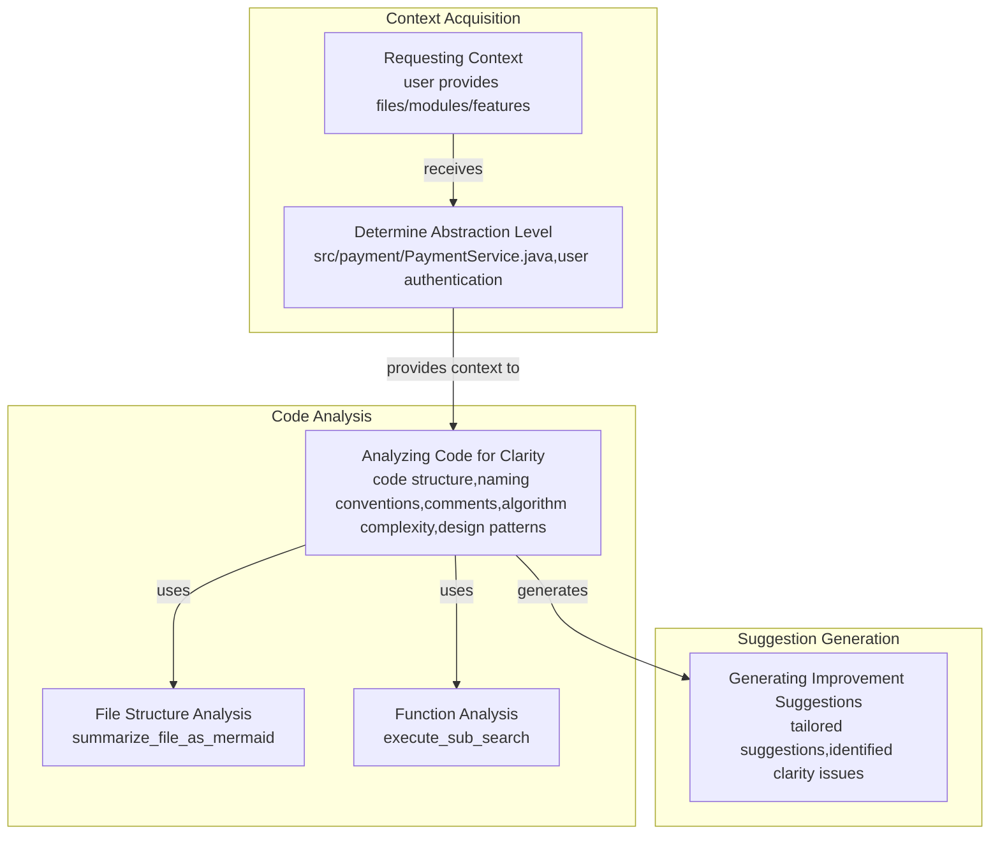

# Codebase Research Report

## Query
can the code be improved for clarity?

## Answer
### System Diagram

### Summary
To assess code clarity and suggest improvements, I need to understand what code you're referring to. Please provide more context, such as:

1.  **Specific files or modules:** If you have particular files or modules in mind, please list them (e.g., `src/payment/PaymentService.java`, `components/checkout/CheckoutButton.js`).
2.  **Functionality or feature:** If you're interested in a specific feature or functionality, describe it (e.g., "the user authentication process", "the handling of shopping cart updates").
3.  **General codebase:** If you want a general assessment of the entire codebase, be aware that this will be a broad and potentially less specific analysis.

Once I have this context, I will:

*   Infer the appropriate Level of Abstraction (LoA) for the analysis.
*   Use the available tools to examine the code, focusing on aspects that affect clarity, such as:
    *   Code structure and organization
    *   Naming conventions
    *   Comments and documentation
    *   Complexity of algorithms
    *   Use of design patterns
*   Generate a Markdown report with specific suggestions for improvement.

For example, if you provide a specific file, I might use `summarize_file_as_mermaid` to understand its structure and then use `execute_sub_search` to analyze specific functions or classes for clarity issues. If you provide a general feature, I might start with `text_search` to identify relevant files and then proceed with more detailed analysis.

## Walkthrough Steps

### 1. Requesting Context for Code Clarity Improvement
The user's question is about improving code clarity. To provide specific advice, the system needs more context. The user should provide specific files, modules, or a description of the functionality they want to improve. This allows the system to focus its analysis.

### 2. Determining the Level of Abstraction
Once the system receives the context (e.g., a file like `src/payment/PaymentService.java` or a feature like 'user authentication'), it will determine the appropriate Level of Abstraction (LoA) for analysis. This helps to focus the analysis on the right level of detail.

### 3. Analyzing Code for Clarity
The system will then use tools to examine the code, focusing on aspects that affect clarity. This includes code structure, naming conventions, comments, algorithm complexity, and the use of design patterns. For example, `summarize_file_as_mermaid` might be used to understand file structure, and `execute_sub_search` to analyze specific functions.

### 4. Generating Improvement Suggestions
Finally, the system will generate a report with specific suggestions for improvement. The suggestions will be tailored to the provided context and the identified clarity issues.

---
*Generated by [CodeViz.ai](https://codeviz.ai) on 6/25/2025, 6:11:56 PM*
