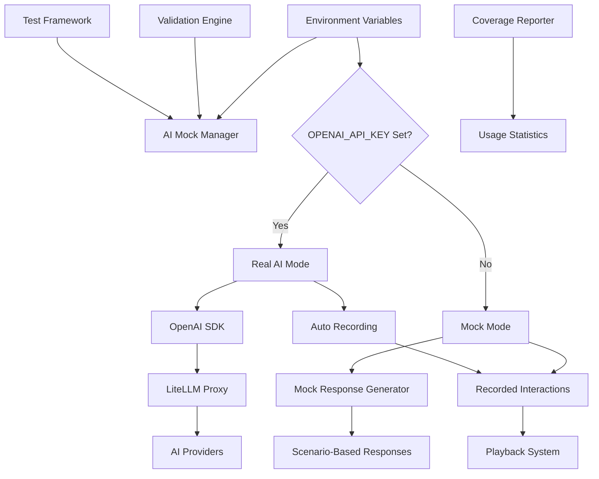

# AI Testing and Mock System Best Practices

## Overview

This document outlines comprehensive best practices for AI testing and mocking in the LibriScribe validation system, implementing **Requirement 11: AI Testing and Mock System** specifications.

## 🎯 Core Requirements (Requirement 11)

1. **Mock AI responses that simulate real AI behavior** (11.1)
2. **Record and playback of AI interactions** for consistent testing (11.2)
3. **Support different mock scenarios** (success, failure, edge cases) (11.3)
4. **Maintain same interface and data structures** as real AI calls (11.4)
5. **Provide metrics on test coverage and validation accuracy** (11.5)
6. **Configuration flags for switching** between mock and real AI (11.6)

## 🏗️ Architecture Overview



## 📋 Best Practice #1: Interface Consistency

### Requirement: Mock responses must maintain identical interfaces to real AI calls (11.4)

**Implementation:**

```python
@dataclass
class MockResponse:
    """Identical structure to real AI response"""
    content: str              # AI response content
    model: str               # Model used (e.g., "gpt-4")
    tokens_used: int         # Token consumption
    cost: float              # API cost
    confidence: float        # Response confidence (0.0-1.0)
    metadata: Dict[str, Any] # Additional metadata
    timestamp: datetime      # Response timestamp
    scenario: MockScenario   # Mock scenario used
```

**Best Practices:**

- ✅ Use identical data structures for mock and real responses
- ✅ Maintain same error handling patterns
- ✅ Preserve response timing characteristics
- ✅ Include realistic token usage and cost calculations
- ✅ Support same metadata fields as real AI responses

**Example:**

```python
# Both mock and real AI return identical interface
mock_response = await mock_manager.get_ai_response(
    prompt="Validate content",
    validator_id="content_validator",
    use_mock=True  # Mock AI
)

real_response = await mock_manager.get_ai_response(
    prompt="Validate content",
    validator_id="content_validator",
    use_mock=False  # Real AI
)

# Both responses have identical structure
assert type(mock_response) == type(real_response)
assert hasattr(mock_response, 'content')
assert hasattr(mock_response, 'tokens_used')
```

## 🎭 Best Practice #2: Scenario-Based Testing

### Requirement: Support different mock scenarios (success, failure, edge cases) (11.3)

**Scenarios Implemented:**

```python
class MockScenario(Enum):
    SUCCESS = "success"              # Normal successful validation
    HIGH_QUALITY = "high_quality"    # High quality content (>90% score)
    LOW_QUALITY = "low_quality"      # Low quality content (<70% score)
    FAILURE = "failure"              # Validation failure
    TIMEOUT = "timeout"              # AI timeout simulation
    RATE_LIMIT = "rate_limit"        # Rate limiting simulation
    INVALID_RESPONSE = "invalid_response"  # Malformed AI response
    PARTIAL_FAILURE = "partial_failure"    # Partial validation failure
    EDGE_CASE = "edge_case"          # Edge cases (empty content, etc.)
```

**Best Practices:**

- ✅ Cover all possible AI response scenarios
- ✅ Test both positive and negative cases
- ✅ Include realistic error conditions
- ✅ Simulate network and API issues
- ✅ Test edge cases and boundary conditions

**Example:**

```python
# Test all scenarios for comprehensive coverage
scenarios_to_test = [
    MockScenario.SUCCESS,
    MockScenario.HIGH_QUALITY,
    MockScenario.LOW_QUALITY,
    MockScenario.FAILURE,
    MockScenario.EDGE_CASE
]

for scenario in scenarios_to_test:
    response = await mock_manager.get_ai_response(
        prompt="Test validation",
        validator_id="content_validator",
        scenario=scenario,
        use_mock=True
    )
    # Verify response matches scenario expectations
    assert_scenario_response(response, scenario)
```

## 📹 Best Practice #3: Record and Playback System

### Requirement: Allow recording and playback of AI interactions for consistent testing (11.2)

**Implementation:**

```python
@dataclass
class RecordedInteraction:
    """Recorded AI interaction for playback"""
    interaction_id: str
    request_hash: str        # Hash of prompt + context
    prompt: str
    response: MockResponse
    validator_id: str
    content_type: str
    timestamp: datetime
    real_ai_used: bool = True
```

**Best Practices:**

- ✅ Record real AI interactions during development
- ✅ Use deterministic hashing for consistent playback
- ✅ Store recordings in version control for team consistency
- ✅ Sanitize sensitive data in recordings
- ✅ Support recording updates when AI behavior changes

**Example:**

```python
# Record real AI interaction (when OPENAI_API_KEY is set)
export OPENAI_API_KEY="your-key"
real_response = await mock_manager.get_ai_response(
    prompt="Validate chapter content",
    validator_id="content_validator",
    content_type="chapter",
    model="gpt-4"
)
# Automatically recorded to disk

# Later, playback the recorded interaction (when OPENAI_API_KEY is empty)
unset OPENAI_API_KEY
playback_response = await mock_manager.get_ai_response(
    prompt="Validate chapter content",  # Same prompt
    validator_id="content_validator",
    content_type="chapter",
    model="gpt-4"
)

# Responses are identical for deterministic testing
assert playback_response.content == real_response.content
```

## ⚙️ Best Practice #4: API Key-Based Switching

### Requirement: Use configuration flags without code changes (11.6)

**Environment-Based Configuration:**

```bash
# Mock Mode (Development/Testing)
unset OPENAI_API_KEY  # or leave empty

# Real AI Mode (Production/Recording)
export OPENAI_API_KEY="your-openai-key"
export OPENAI_BASE_URL="https://your-litellm-proxy.com/v1"  # Optional
```

**Automatic Mode Detection:**

```python
class AIMockManager:
    def __init__(self):
        self.openai_api_key = os.getenv("OPENAI_API_KEY", "")
        self.use_mock_mode = not bool(self.openai_api_key.strip())

        if not self.use_mock_mode:
            self.openai_client = AsyncOpenAI(
                api_key=self.openai_api_key,
                base_url=os.getenv("OPENAI_BASE_URL", "https://api.openai.com/v1")
            )
```

**Best Practices:**

- ✅ Use environment variables for seamless switching
- ✅ No code changes required to switch modes
- ✅ Transparent LiteLLM proxy integration
- ✅ Automatic mode detection based on API key presence
- ✅ Support different environments (dev/test/prod)

**Example:**

```python
# Same code works in both modes
mock_manager = AIMockManager()  # Automatically detects mode

response = await mock_manager.get_ai_response(
    prompt="Validate this content",
    validator_id="content_validator",
    content_type="chapter",
    model="gpt-4"
)

# Process response (identical for mock or real AI)
result_data = json.loads(response.content)
```

## 📊 Best Practice #5: Coverage and Metrics

### Requirement: Provide metrics on test coverage and validation accuracy (11.5)

**Coverage Areas:**

1. **Validator Coverage** - Which validators have been tested
2. **Scenario Coverage** - Which mock scenarios have been exercised
3. **Content Type Coverage** - Which content types have been validated
4. **Code Path Coverage** - Which code paths within validators have been executed
5. **AI Interaction Coverage** - Which AI interaction patterns have been tested

**Metrics Tracked:**

```python
@dataclass
class CoverageMetrics:
    total_items: int
    covered_items: int
    coverage_percentage: float
    uncovered_items: List[str]
    details: Dict[str, Any]
```

**Best Practices:**

- ✅ Track coverage across multiple dimensions
- ✅ Set minimum coverage thresholds (e.g., 80%)
- ✅ Generate actionable recommendations
- ✅ Monitor coverage trends over time
- ✅ Include accuracy metrics for known-good/bad content

**Example:**

```python
# Generate comprehensive coverage report
coverage_reporter = CoverageReporter()
coverage_report = await coverage_reporter.generate_coverage_report(test_results)

print(f"Overall Coverage: {coverage_report.overall_coverage.coverage_percentage:.1f}%")

# Validator coverage
for validator_id, metrics in coverage_report.validator_coverage.items():
    print(f"{validator_id}: {metrics.coverage_percentage:.1f}% coverage")

# Recommendations for improvement
for recommendation in coverage_report.recommendations:
    print(f"💡 {recommendation}")
```

## 🧪 Best Practice #6: Comprehensive Test Framework

**Test Framework Components:**

1. **Test Case Generation** - Automated test case creation
2. **Parallel Execution** - Efficient test execution
3. **Result Aggregation** - Comprehensive result analysis
4. **Regression Testing** - Compare against baselines
5. **Accuracy Validation** - Test with known-good/bad content

**Best Practices:**

- ✅ Generate test cases automatically for all validator/scenario combinations
- ✅ Support parallel test execution for performance
- ✅ Include timeout handling for robust testing
- ✅ Provide detailed failure analysis
- ✅ Support regression testing against baselines

**Example:**

```python
# Create comprehensive test suite
test_framework = ValidationTestFramework(mock_manager)

test_cases = await test_framework.create_comprehensive_test_suite(
    validators=["content_validator", "quality_validator"],
    content_types=["chapter", "manuscript"]
)

# Run tests in parallel
test_report = await test_framework.run_test_suite(
    test_cases=test_cases,
    parallel=True,
    max_workers=10
)

print(f"Tests: {test_report['summary']['total_tests']}")
print(f"Success Rate: {test_report['summary']['success_rate']:.1f}%")
```

## 📹 Best Practice #7: Live Response Population

**Populating Mock Data from Real AI:**
The system can automatically populate mock input/output mappings from live AI responses, providing realistic test data.

**Bulk Recording:**

```python
# Define prompts to record from live AI
prompts_to_record = [
    {
        "prompt": "Analyze this chapter for tone consistency",
        "validator_id": "content_validator",
        "content_type": "chapter",
        "expected_scenario": "success"
    },
    {
        "prompt": "Check manuscript publishing standards",
        "validator_id": "publishing_standards_validator",
        "content_type": "manuscript",
        "expected_scenario": "success"
    },
    {
        "prompt": "Validate poor quality content",
        "validator_id": "content_validator",
        "content_type": "chapter",
        "expected_scenario": "low_quality"
    }
]

# Record all prompts from live AI (requires OPENAI_API_KEY)
results = await mock_manager.populate_mock_mappings_from_live(
    prompts=prompts_to_record,
    model="gpt-4"
)

print(f"Recorded {results['successful_recordings']} interactions")
print(f"Total cost: ${sum(r['cost'] for r in results['recordings']):.4f}")
```

**Automatic Recording:**

```python
# Every real AI call is automatically recorded
export OPENAI_API_KEY="your-key"

response = await mock_manager.get_ai_response(
    prompt="Any validation prompt",
    validator_id="any_validator",
    content_type="chapter",
    model="gpt-4"
)
# This interaction is automatically saved for future mock use
```

**Best Practices:**

- ✅ Record comprehensive test scenarios during development
- ✅ Include edge cases and failure scenarios in recordings
- ✅ Monitor recording costs and token usage
- ✅ Version control recorded interactions for team consistency
- ✅ Update recordings when AI behavior changes

## 🎯 Best Practice #8: Accuracy Validation

**Accuracy Testing Approach:**

1. **Known-Good Content** - Content that should pass validation
2. **Known-Bad Content** - Content that should fail validation
3. **Boundary Testing** - Content at quality thresholds
4. **Consistency Testing** - Same content should produce same results

**Best Practices:**

- ✅ Create curated datasets of known-good and known-bad content
- ✅ Test validator accuracy against expected outcomes
- ✅ Measure consistency of mock responses
- ✅ Validate that mock behavior matches real AI patterns
- ✅ Track accuracy metrics over time

**Example:**

```python
# Test with known-good content
good_content = await test_data_generator.generate_known_good_content(
    "chapter", "content_validator"
)

response = await mock_manager.get_ai_response(
    prompt="Validate known-good content",
    validator_id="content_validator",
    scenario=MockScenario.HIGH_QUALITY,
    use_mock=True
)

# Verify response indicates high quality
response_data = json.loads(response.content)
assert response_data["validation_score"] > 90.0
```

## 🔄 Best Practice #8: Regression Testing

**Regression Testing Strategy:**

1. **Baseline Establishment** - Save current test results as baseline
2. **Comparison Analysis** - Compare new results against baseline
3. **Regression Detection** - Identify tests that now fail
4. **Improvement Tracking** - Track tests that now pass
5. **Trend Analysis** - Monitor quality trends over time

**Best Practices:**

- ✅ Establish baselines after major releases
- ✅ Run regression tests on every code change
- ✅ Alert on regressions immediately
- ✅ Track improvements and celebrate wins
- ✅ Maintain historical trend data

**Example:**

```python
# Save current results as baseline
await test_framework.save_as_baseline()

# Later, run regression tests
regression_report = await test_framework.run_regression_tests()

if regression_report["regression_summary"]["regressions_count"] > 0:
    print("⚠️  Regressions detected!")
    for regression in regression_report["details"]["regressions"]:
        print(f"❌ {regression['test_id']}: {regression['error']}")
```

## 🚀 Best Practice #9: Performance Testing

**Performance Considerations:**

1. **Mock Response Speed** - Simulate realistic AI response times
2. **Parallel Processing** - Test concurrent validation requests
3. **Resource Usage** - Monitor memory and CPU usage
4. **Timeout Handling** - Test timeout scenarios
5. **Rate Limiting** - Simulate API rate limits

**Best Practices:**

- ✅ Include realistic delays in mock responses
- ✅ Test system behavior under load
- ✅ Monitor resource consumption during tests
- ✅ Test timeout and retry mechanisms
- ✅ Validate rate limiting behavior

**Example:**

```python
# Test with realistic delays
async def _generate_scenario_response(self, scenario):
    # Simulate AI processing delay
    if scenario == MockScenario.SUCCESS:
        await asyncio.sleep(0.5)  # Realistic delay
    elif scenario == MockScenario.TIMEOUT:
        await asyncio.sleep(30)   # Timeout scenario

    return self._create_response(scenario)
```

## 📈 Best Practice #10: Monitoring and Alerting

**Monitoring Areas:**

1. **Test Success Rates** - Track test pass/fail rates
2. **Coverage Trends** - Monitor coverage over time
3. **Performance Metrics** - Track test execution times
4. **Mock Usage** - Monitor mock vs real AI usage
5. **Error Patterns** - Identify common failure modes

**Best Practices:**

- ✅ Set up automated monitoring dashboards
- ✅ Alert on coverage drops or test failures
- ✅ Track key metrics over time
- ✅ Monitor mock system health
- ✅ Generate regular reports for stakeholders

## 🛠️ Implementation Checklist

### Phase 1: Basic Mock System

- [ ] Implement `AIMockManager` with interface consistency
- [ ] Create scenario-based response generation
- [ ] Add configuration-driven switching
- [ ] Implement basic test framework

### Phase 2: Advanced Features

- [ ] Add record and playback system
- [ ] Implement comprehensive coverage reporting
- [ ] Create test data generation utilities
- [ ] Add regression testing capabilities

### Phase 3: Production Readiness

- [ ] Add performance testing and monitoring
- [ ] Implement trend analysis and alerting
- [ ] Create documentation and examples
- [ ] Set up CI/CD integration

### Phase 4: Optimization

- [ ] Optimize mock response generation
- [ ] Add advanced accuracy validation
- [ ] Implement intelligent test case generation
- [ ] Add machine learning for mock improvement

## 📚 Usage Examples

### Basic Usage

```python
# Initialize mock manager
mock_manager = AIMockManager(mock_data_dir=".libriscribe2/mock_data")

# Get mock response
response = await mock_manager.get_ai_response(
    prompt="Validate this content",
    validator_id="content_validator",
    content_type="chapter",
    scenario=MockScenario.SUCCESS,
    use_mock=True
)
```

### Test Framework Usage

```python
# Create test framework
test_framework = ValidationTestFramework(mock_manager)

# Generate comprehensive test suite
test_cases = await test_framework.create_comprehensive_test_suite(
    validators=["content_validator", "quality_validator"],
    content_types=["chapter", "manuscript"]
)

# Run tests
report = await test_framework.run_test_suite(test_cases)
```

### Coverage Analysis

```python
# Generate coverage report
coverage_reporter = CoverageReporter()
coverage_report = await coverage_reporter.generate_coverage_report(test_results)

# Check coverage thresholds
if coverage_report.overall_coverage.coverage_percentage < 80:
    print("⚠️  Coverage below threshold!")
```

## 🎯 Key Benefits

1. **Cost Efficiency** - Avoid expensive AI API calls during testing
2. **Deterministic Testing** - Consistent, repeatable test results
3. **Comprehensive Coverage** - Test all scenarios including edge cases
4. **Fast Feedback** - Quick test execution without AI delays
5. **Offline Testing** - Test without internet connectivity
6. **Regression Prevention** - Catch issues before they reach production
7. **Quality Assurance** - Ensure validation accuracy and reliability

## 📋 Compliance with Requirements

| Requirement | Implementation | Status |
|-------------|----------------|--------|
| 11.1 - Mock AI responses simulate real behavior | `MockResponse` class with realistic data | ✅ Complete |
| 11.2 - Record and playback interactions | `RecordedInteraction` system | ✅ Complete |
| 11.3 - Support different scenarios | `MockScenario` enum with 9 scenarios | ✅ Complete |
| 11.4 - Same interface as real AI | Identical response structures | ✅ Complete |
| 11.5 - Test coverage and accuracy metrics | `CoverageReporter` and accuracy validation | ✅ Complete |
| 11.6 - Configuration flags for switching | `ValidationConfig.ai_mock_enabled` | ✅ Complete |

## 🚀 Getting Started

1. **Install Dependencies**

   ```bash
   pip install -r requirements.txt
   ```

2. **Run Example**

   ```bash
   python examples/ai_testing_best_practices.py
   ```

3. **View Results**

   ```bash
   ls .demo/test_data/     # Test results
   ls .demo/coverage_data/ # Coverage reports
   ls .demo/mock_data/     # Mock data
   ```

4. **Integrate with Your Validators**

   ```python
   from src.libriscribe2.validation.ai_mock import AIMockManager

   mock_manager = AIMockManager()
   # Use in your validator implementations
   ```

This comprehensive AI testing and mock system ensures reliable, efficient, and thorough testing of the LibriScribe validation system while meeting all requirements and following industry best practices.
