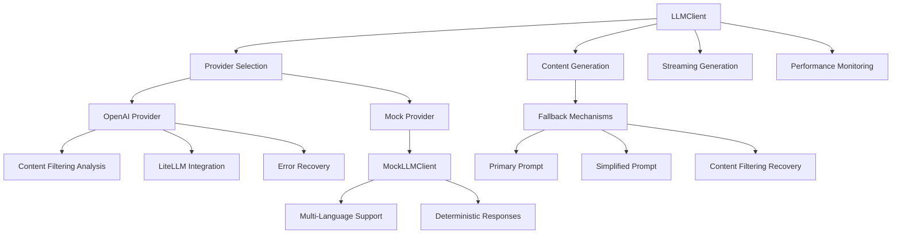

# LLM Client Architecture and Recent Improvements

## Overview

The LibriScribe2 LLM Client has been significantly enhanced to provide robust, production-ready AI integration with comprehensive error handling, content filtering fallback, and multi-provider support. This document outlines the architecture, recent improvements, and best practices.

## Recent Code Improvement

### Exception Handling Enhancement

**Change Made:**
```python
# Before (line 380)
except:
    pass

# After (line 380)
except (json.JSONDecodeError, KeyError, TypeError):
    pass
```

**Impact:**
- **Improved Error Specificity**: Now catches only specific JSON-related exceptions instead of all exceptions
- **Better Debugging**: Allows unexpected exceptions to propagate for proper error handling
- **Code Quality**: Follows Python best practices for exception handling
- **Maintainability**: Makes the code more explicit about what errors are expected

**Context:**
This change occurs in the `_create_simplified_prompt()` method when attempting to parse JSON content from prompts. The method tries to extract structured data from prompts that contain JSON, and if parsing fails, it gracefully falls back to a simpler prompt format.

## Architecture Overview

### Core Components



### Key Features

1. **Multi-Provider Architecture**
   - OpenAI integration with LiteLLM proxy support
   - Mock provider for testing and development
   - Extensible design for additional providers

2. **Advanced Error Handling**
   - Specific exception types for different error conditions
   - Comprehensive error context and logging
   - Automatic retry mechanisms with exponential backoff

3. **Content Filtering Resilience**
   - Automatic detection of content filtering triggers
   - Multi-level fallback system
   - Prompt simplification algorithms

4. **Performance Optimization**
   - Async/await patterns throughout
   - Connection pooling and session management
   - Timing and metrics collection

## Provider Implementations

### OpenAI Provider

**Features:**
- Full OpenAI API compatibility
- LiteLLM proxy integration with metadata tagging
- Comprehensive request/response validation
- Content filtering detection and recovery
- Timeout and retry handling

**Configuration:**
```python
client = LLMClient(
    provider="openai",
    model_config={
        "creative": "gpt-4o",
        "general": "gpt-4o-mini",
        "analysis": "gpt-4o"
    },
    timeout=300.0,
    environment="production",
    project_name="my-book-project"
)
```

**Error Handling:**
- Network connectivity issues
- API rate limiting
- Content filtering responses
- Invalid response formats
- Timeout conditions

### Mock Provider

**Features:**
- Deterministic responses for testing
- Multi-language content generation (English, French, Spanish)
- Configurable content length and structure
- JSON response simulation
- No external dependencies or API costs

**Configuration:**
```python
mock_client = MockLLMClient(
    model_config={"creative": "mock-gpt-4"},
    mock_config={
        "scene_length": {"min_words": 200, "max_words": 400},
        "chapter_length": {"min_words": 1000, "max_words": 2000}
    }
)
```

## Content Filtering System

### Detection Mechanisms

The LLM client includes sophisticated content filtering detection:

```python
def _analyze_content_filtering_triggers(self, prompt: Any) -> list[str]:
    """Analyze prompt for potential content filtering triggers."""
```

**Detected Patterns:**
- Unicode escape sequences
- HTML-like tags
- JavaScript injection attempts
- URLs and email patterns
- IP addresses
- Non-ASCII characters
- Excessive length or repetition

### Fallback Strategy

1. **Primary Prompt**: Original user prompt
2. **Fallback Prompt**: User-provided alternative
3. **Simplified Prompt**: Auto-generated simplified version
4. **Error Handling**: Graceful failure with context

```python
async def generate_content_with_content_filtering_fallback(
    self,
    primary_prompt: str,
    fallback_prompt: str | None = None,
    max_retries: int = 2,
    **kwargs: Any,
) -> str | None:
```

### Prompt Simplification

The system automatically creates simplified prompts when content filtering is detected:

```python
def _create_simplified_prompt(self, original_prompt: str, prompt_type: str) -> str:
    """Create a simplified version of the prompt to avoid content filtering."""
```

**Simplification Strategies:**
- Extract essential information from JSON structures
- Remove potentially problematic content
- Reduce prompt length
- Use safer vocabulary and phrasing

## Model Configuration System

### Per-Prompt-Type Models

The client supports different models for different types of content:

```python
DEFAULT_MODEL_CONFIG = {
    "general": "gpt-4o-mini",           # General purpose, cost-effective
    "creative": "gpt-4o",               # Creative writing, higher quality
    "analysis": "gpt-4o",               # Text analysis, reasoning
    "title_generation": "gpt-4o-mini",  # Simple tasks
    "character_generation": "gpt-4o",   # Complex character development
    "outline_generation": "gpt-4o",     # Story structure
    "chapter_writing": "gpt-4o",        # Long-form content
    "worldbuilding": "gpt-4o",          # Complex world creation
    "review": "gpt-4o",                 # Content evaluation
}
```

### Dynamic Model Selection

```python
def get_model_for_prompt_type(self, prompt_type: str) -> str:
    """Gets the specific model for a given prompt type, falling back to default."""
    return self.model_config.get(prompt_type, self.model_config.get("default", "gpt-4o-mini"))
```

## Performance Monitoring

### Timing and Metrics

```python
async def generate_content_with_timing(self, prompt: str, **kwargs: Any) -> tuple[str, float]:
    """Generate content with timing information."""
    start_time = time.time()
    result = await self.generate_content(prompt, **kwargs)
    duration = time.time() - start_time
    return result, duration
```

### Resource Management

```python
@asynccontextmanager
async def client_session(self):
    """Async context manager for LLM client sessions."""
    try:
        self.logger.info("Starting LLM client session")
        yield self
    finally:
        self.logger.info("LLM client session completed")
```

## LiteLLM Integration

### Metadata Tagging

The client automatically includes metadata in requests:

```python
headers = {
    "Authorization": f"Bearer {api_key}",
    "Content-Type": "application/json"
}

# Add LiteLLM tags
if self.project_name:
    headers["X-Litellm-Tag-Project"] = self.project_name
if self.environment:
    headers["X-Litellm-Tag-Environment"] = self.environment
if self.user:
    headers["X-Litellm-Tag-User"] = self.user
```

### Proxy Configuration

```python
# Environment variables for LiteLLM
OPENAI_API_KEY=your-api-key
OPENAI_BASE_URL=https://your-litellm-proxy.com/v1
```

## Error Recovery Patterns

### Hierarchical Fallback

1. **Primary Generation**: Use specified model and prompt
2. **Model Fallback**: Try fallback model if primary fails
3. **Prompt Fallback**: Use simplified prompt if content filtering detected
4. **Provider Fallback**: Switch to mock provider if all else fails

### Exception Hierarchy

```python
try:
    content = await client.generate_content(prompt)
except LLMClientError as e:
    if "timeout" in str(e).lower():
        # Handle timeout with retry
        pass
    elif "content filtering" in str(e).lower():
        # Handle content filtering with fallback
        pass
    elif "rate limit" in str(e).lower():
        # Handle rate limiting with backoff
        pass
    else:
        # Handle other errors
        pass
```

## Testing Strategy

### Mock Integration

```python
# Development/Testing
client = LLMClient(provider="mock")

# Production
client = LLMClient(provider="openai")
```

### Deterministic Testing

```python
mock_client = MockLLMClient()
content = mock_client.generate_content("test prompt", "character")
# Always returns consistent character data for testing
```

### Performance Testing

```python
async def benchmark_generation():
    client = LLMClient("openai")

    start_time = time.time()
    tasks = [
        client.generate_content(f"Test prompt {i}", "general")
        for i in range(10)
    ]
    results = await asyncio.gather(*tasks)
    duration = time.time() - start_time

    print(f"Generated {len(results)} responses in {duration:.2f}s")
    print(f"Average: {duration/len(results):.2f}s per request")
```

## Security Considerations

### Input Sanitization

```python
def validate_prompt(self, prompt: Any) -> bool:
    """Validate prompt using Python 3.12 features."""
    if not isinstance(prompt, str):
        return False
    if not prompt.strip():
        return False
    if len(prompt) > DEFAULT_MAX_TOKENS:
        return False
    return True
```

### API Key Protection

```python
# Safe logging with API key truncation
safe_headers = headers.copy()
if "Authorization" in safe_headers:
    auth_value = safe_headers["Authorization"]
    if auth_value.startswith("Bearer "):
        api_key = auth_value[7:]
        truncated_key = api_key[:5] + "..." if len(api_key) > 5 else api_key
        safe_headers["Authorization"] = f"Bearer {truncated_key}"
```

### Content Filtering

The system proactively analyzes prompts for potentially problematic content and applies appropriate safeguards.

## Best Practices

### 1. Model Selection

```python
# Use cost-effective models for simple tasks
model_config = {
    "simple_tasks": "gpt-4o-mini",
    "complex_tasks": "gpt-4o"
}
```

### 2. Error Handling

```python
# Always handle LLMClientError with context
try:
    content = await client.generate_content(prompt)
except LLMClientError as e:
    logger.error(f"Generation failed: {e}")
    logger.error(f"Provider: {e.provider}")
    logger.error(f"Context: {e.context}")
```

### 3. Resource Management

```python
# Use context managers for proper cleanup
async with LLMClient("openai") as client:
    content = await client.generate_content(prompt)
```

### 4. Performance Optimization

```python
# Use appropriate timeouts
client = LLMClient("openai", timeout=300.0)

# Monitor performance
content, duration = await client.generate_content_with_timing(prompt)
```

### 5. Testing

```python
# Use mock provider for tests
@pytest.fixture
def mock_llm_client():
    return LLMClient("mock")

def test_content_generation(mock_llm_client):
    content = await mock_llm_client.generate_content("test")
    assert content is not None
```

## Future Enhancements

### Planned Features

1. **Additional Providers**
   - Anthropic Claude integration
   - Google Gemini support
   - Local model support

2. **Advanced Caching**
   - Response caching for repeated prompts
   - Intelligent cache invalidation
   - Distributed caching support

3. **Enhanced Monitoring**
   - Real-time performance metrics
   - Cost tracking and optimization
   - Usage analytics

4. **Improved Fallback**
   - Machine learning-based prompt optimization
   - Dynamic model selection based on performance
   - Adaptive retry strategies

### Migration Path

The current architecture is designed to support these enhancements without breaking changes to the public API.

## Conclusion

The LibriScribe2 LLM Client provides a robust, production-ready foundation for AI integration with comprehensive error handling, content filtering resilience, and performance optimization. The recent exception handling improvement exemplifies the ongoing commitment to code quality and maintainability.

The architecture supports both development and production use cases through its dual-provider system, extensive configuration options, and comprehensive monitoring capabilities.
